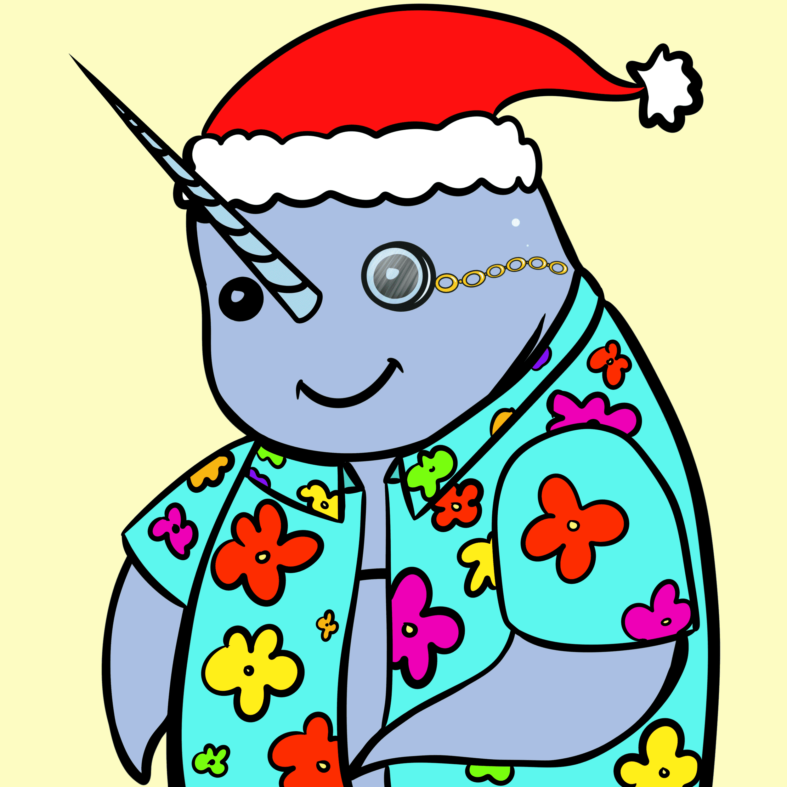

# The Gnarwhals NFT

欢迎来到独角鲸 nft 收藏！我们是 1,111 只独角鲸 NFT 探索公海的祝福。一群独角鲸被称为祝福。 祝福可以帮助彼此在人生旅途中以有趣、积极和可持续的运动来照顾自己。使用您的独角鲸兑换带有自我护理产品的祝福盒，并带着祝福在 Web 3 的深处航行！见 亚特兰蒂斯！官网：thegnarwhals.io

The Gnarwhals NFT NFT - 常见问题（FAQ）
▶ 什么是 The Gnarwhals NFT？
Gnarwhals NFT 是一个 NFT（Non-fungible token）集合。 存储在区块链上的数字艺术品集合。
▶ The Gnarwhals NFT 代币有多少？
总共有 275 个 The Gnarwhals NFT NFT。 目前，86 位所有者的钱包中至少有一个 The Gnarwhals NFT NTF。
▶ The Gnarwhals NFT 最近卖出了多少？
过去 30 天共售出 0 个 The Gnarwhals NFT NFT。

