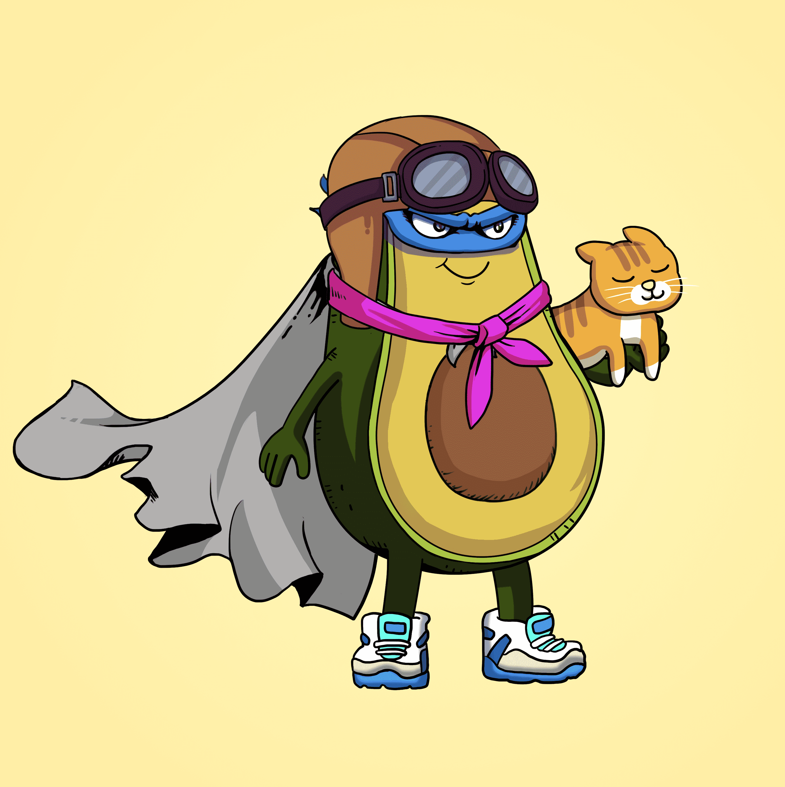

# The Good Avocados

Good Avocado NFT（加密爱好者）的私人社区每个都由 186 多个属性组成，展示了他们的大个性和超能力。起源故事：我们的鳄梨（Babycados）在生命早期就注意到并非所有其他人的成长都相同。 一些 Cadokids 真的很好，充满了善良和善良。 但是由于某种原因，其他人非常腐烂和令人讨厌。 注意到腐烂的牛油果对社区造成的负面影响，好牛油果组成了一个善意的联盟，以加强世界各地所有牛油果的善良。 使命与目的：善举团结在一起，Good Avocados 代表了在任何地方的每一个鳄梨中发现的内在品质。 被一个共同的目标捆绑在一起，他们找到了一种强烈的接受感、目标感和归属感。所有持有者将从衍生系列 Guac Babies 和 Cado Kids 中获得 2 个免费的额外 NFT，这些 NFT 将在该系列售罄后 2-3 周内下降 .

