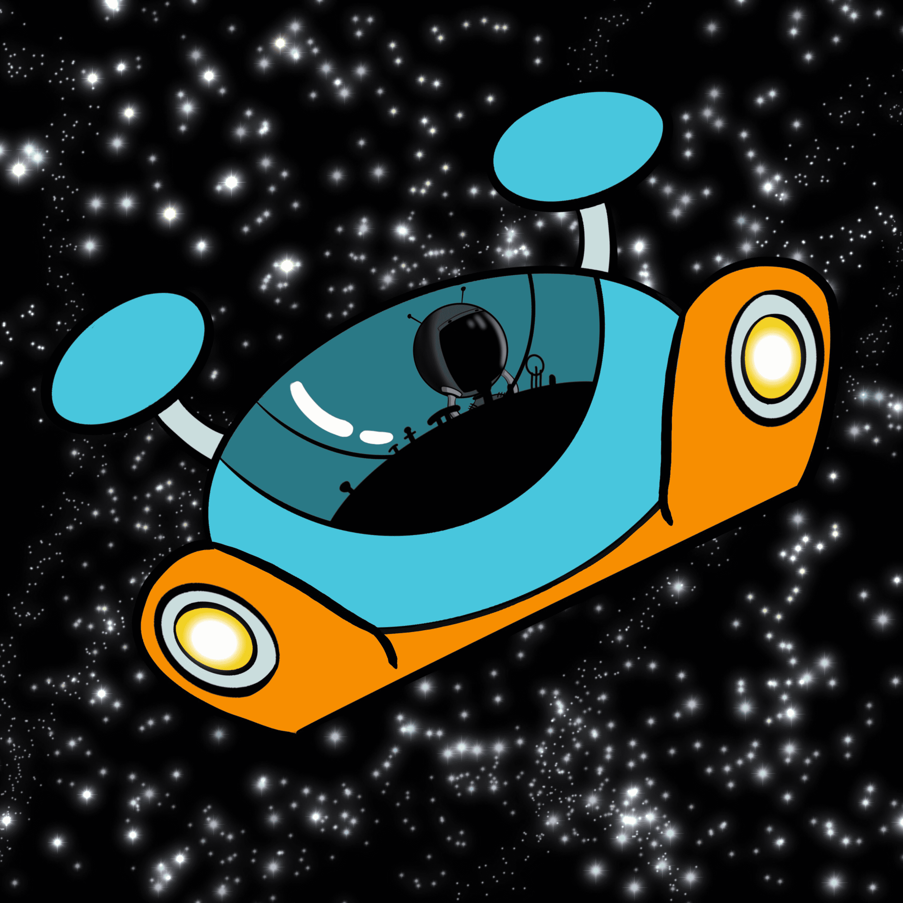

# The Greys TV

感谢您对The Greys TV动画项目的早期支持

以及您对The Greys TV NFT的兴趣！请继续关注此页面和我们的Twitter，以推出我们的Discord和社区，即将推出！

遇见灰人！
The Greys是一部由NFT资助和DAO驱动的新动画系列，以“The Greys”为特色，这是一个生活在Nebulon Fragment Twelve（NFT）上的摇滚外星人家庭，他们“拯救”了Mason，一个来自<哎呀！>地球！

我们的艺术家！
80年代所有事物的爱好者，我们的艺术家以其速度画和名人死亡致敬艺术而闻名，我们的艺术家确实是真正特别的！

我们的作家和声音！
当一个“技术人员”退休并追求他对配音，单口喜剧和编剧的热情时，就会发生这种情况！

