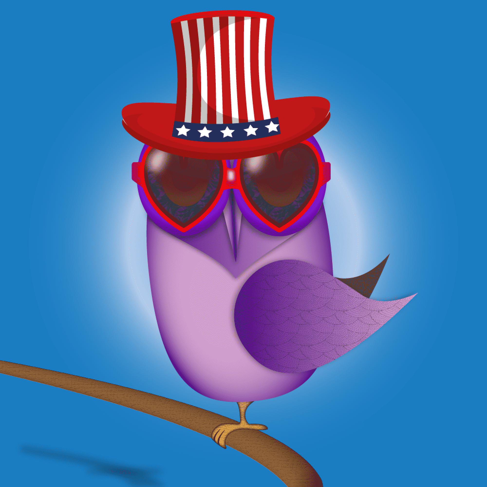

# The Groovy Owl Society Episode 01

时髦的猫头鹰协会NFT
4444 独特的 NFT 在第 1 集中遵循概念音乐平台

其背后的概念效用是全球音乐艺术家之间的合作。为此，将在英国推出一家音乐时尚森林咖啡馆，并在Metaverse上几乎被称为“时髦猫头鹰协会”3只猫头鹰=终身被动收入。
从Apple iPhone 13 Pro到Apple Watch到Playstation 5，Xbox，Eth空投以及更多针对Minters的赠品。

关于本项目
有一个时髦的山峰！

时髦的猫头鹰协会是不可替代艺术协会的独特集合，我们将在第一集中推出4444个独特的NFT。
其背后的概念效用是全球音乐艺术家之间的合作。为此，有一个音乐时尚森林咖啡馆将在英国推出，并且几乎在Metaverse上推出。该项目还将服务于全球需求的一个最关键方面，以帮助森林护理并以捐赠和社会服务的形式应对气候变化。
Groovy Owl Society Project是使用ERC-721A标准在以太坊网络上创建的。每个NFT都有一个唯一的DNA地址，并通过集成的Web安全功能上传到WEB 3 ipfs服务器上。

