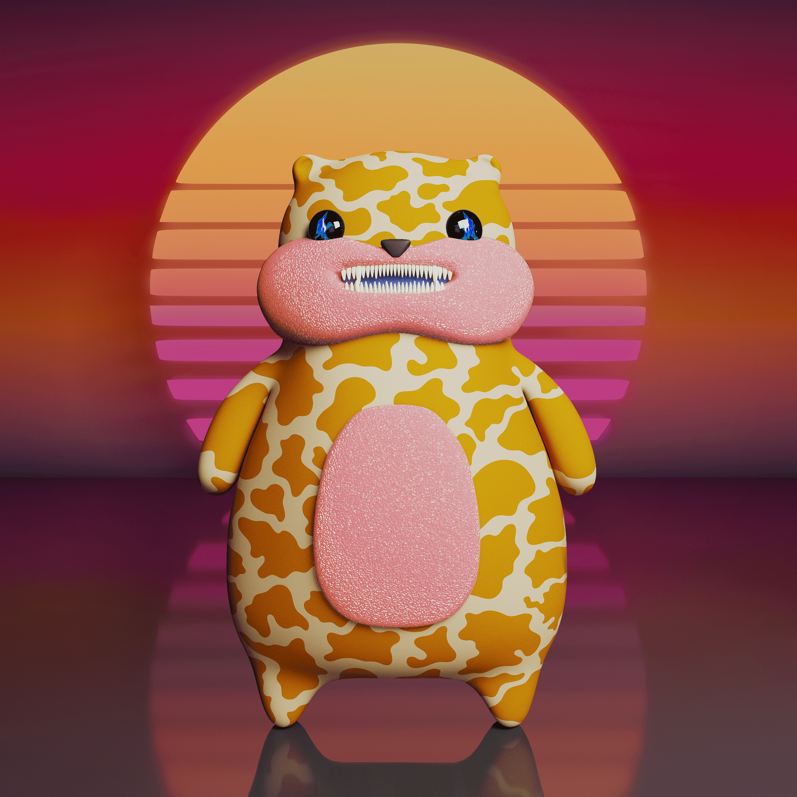

# The Hamster Game

第一个 Trade-2-Earn NFT 游戏！ Polygon 区块链上的 20,000 个 NFT 的集合现在 10,202 个 NFT 即将动画系列 也许你的仓鼠会成为动画系列中的英雄买/卖“抽水”或“转储”仓鼠赚取代币重复

The Hamster Game 的总销售额为 1.57 美元。 The Hamster Game NFT 的平均价格为 1.6 美元。 有 1,136 名仓鼠游戏所有者，拥有 10,202 个代币的总供应量。

什么是仓鼠游戏？
仓鼠游戏是一个 NFT（非同质代币）集合。 存储在区块链上的数字艺术品集合。
▶ 仓鼠游戏代币有多少？
总共有 10,202 个仓鼠游戏 NFT。 目前，1,136 位所有者的钱包中至少有一个 The Hamster Game NTF。
▶ The Hamster Game 最昂贵的交易是什么？
最昂贵的 The Hamster Game NFT 是 Pump #10060。 它于 2022-06-27（2 个月前）以 1.6 美元的价格售出。
▶ 最近卖了多少仓鼠游戏？
过去 30 天内售出了 1 个 The Hamster Game NFT。
▶ 什么是流行的仓鼠游戏替代品？
许多拥有 The Hamster Game NFT 的用户还拥有 Hexarchia Warlords、SPELLFIRE、Rich Goat Club 和 Hiro Wrestlers。

