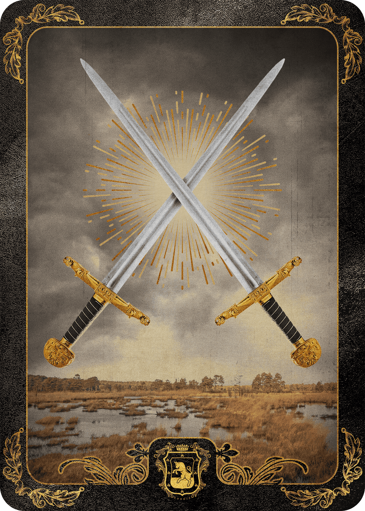

# The House Game

BrokeBoyz合同房子现在是 BrokeBoyz 的一部分，更多信息即将推出！

The House 是一个文化机构，其历史可以追溯到 14 世纪。 我们是智慧、文化、知识和权力的殿堂。 我们统治了佛罗伦萨的土地，并建立了一些世界上最伟大的文化壮举。 我们能够一起探索将创新与艺术交织在一起的未来技术发展的无限可能性。

The House Game NFT - 常见问题（FAQ）
▶ 什么是家庭游戏？
House Game 是一个 NFT（非同质代币）集合。 存储在区块链上的数字艺术品集合。
▶ 有多少 The House Game 代币？
总共有 3,550 个 The House Game NFT。 目前，760 位所有者的钱包中至少有一个 The House Game NTF。
▶ The House Game 最近卖出了多少？
过去 30 天内售出 0 个 The House Game NFT。

