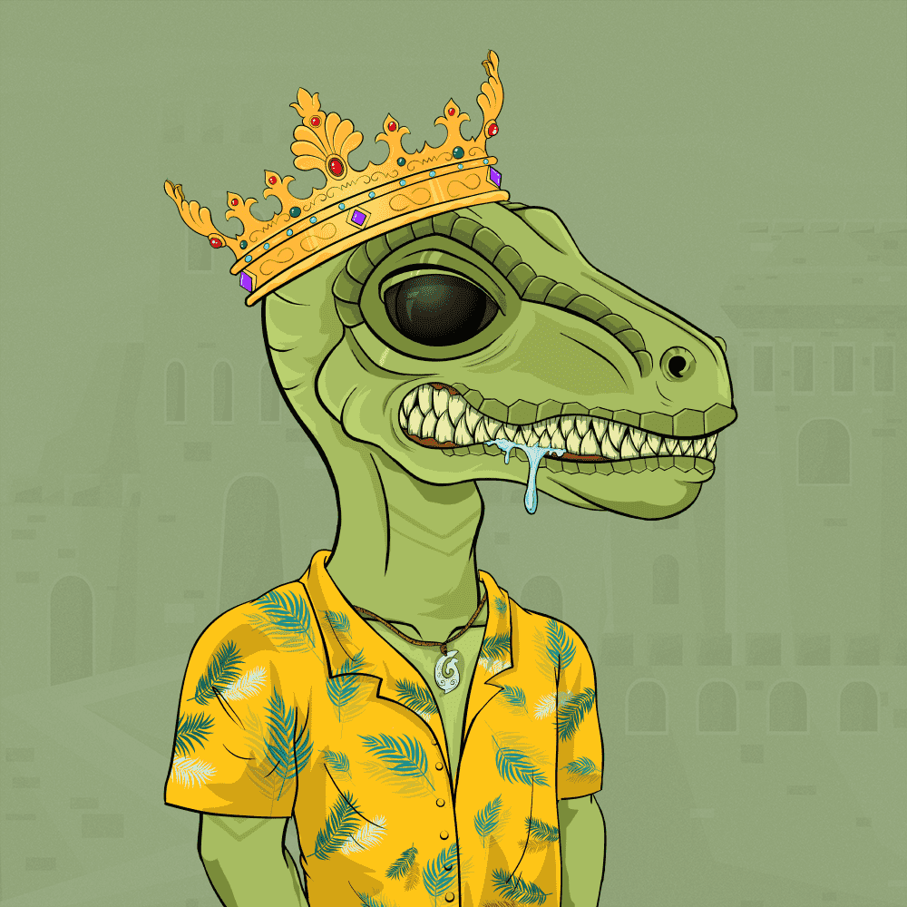

# The Last Raptor*

“你知道什么比高质量的艺术品更好吗？具有实用性的高质量艺术品！”考虑到这一概念，我们超越了这一概念，创造了一个改变游戏规则的 NFT 收藏品。 The Last Raptor 是 1923 年生成的 Raptor 的集合，包含数百个手绘作品。目标是让每个 Raptor 都具有独特的品质，高于数量。只要你的钱包里至少有一只猛禽，你就会 沿途受益匪浅。TheLastRaptor

1923年独特的猛
龙即将释放
“你知道什么比一件高质量的艺术品更好吗？一件具有实用性的高品质艺术品！

考虑到这个概念，我们超越了一个NFT系列，成为游戏规则的改变者。《最后的猛禽》是1923年生成猛龙的合集，拥有数百件手绘作品。

每件作品都是独一无二的，有自己的调色板和构图。目标是让每只猛龙都与众不同，把质量放在数量之上。只要你在钱包里至少放一只猛禽，你就会一路上得到好处。

