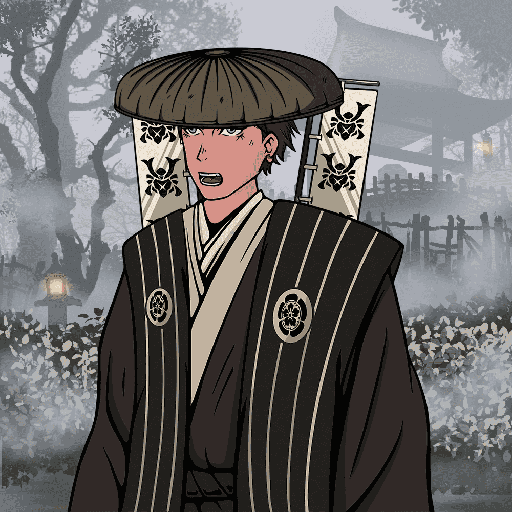

# The Last Samurais | TLS

The Last Samurais 是 Samurais 的 333 个生成 NFT 角色的集合。

什么是最后的武士 | TLS？
最后的武士 | TLS 是一个 NFT（不可替代令牌）集合。存储在区块链上的数字艺术品集合。
▶ 最后的武士有多少 | TLS 令牌存在吗？
总共有 333 名最后的武士 | TLS NFT。目前 207 位业主至少拥有一部 The Last Samurais | TLS NTF 在他们的钱包里。
▶ 《最后的武士》最贵的是什么 | TLS 销售？
最昂贵的最后的武士|出售的 TLS NFT 是 TLS #76。它于 2022 年 6 月 9 日（3 个月前）以 304.2 美元的价格售出。
▶ 最后的武士有多少 | TLS最近卖了？
有 22 最后的武士 |过去 30 天内售出的 TLS NFT。
▶ 最后的武士多少钱 | TLS 费用？
过去 30 天最便宜的 The Last Samurais | TLS NFT 销售额低于 132 美元，最高销售额超过 278 美元。 The Last Samurais 的中位价 | TLS NFT 在过去 30 天内为 202 美元。
▶ 流行什么《最后的武士》 | TLS 替代品？
许多拥有《最后的武士》的用户| TLS NFT 还拥有 The Emissaries、Droid Invaders、OnChain Seasides 和 Anonymous Collectors。

