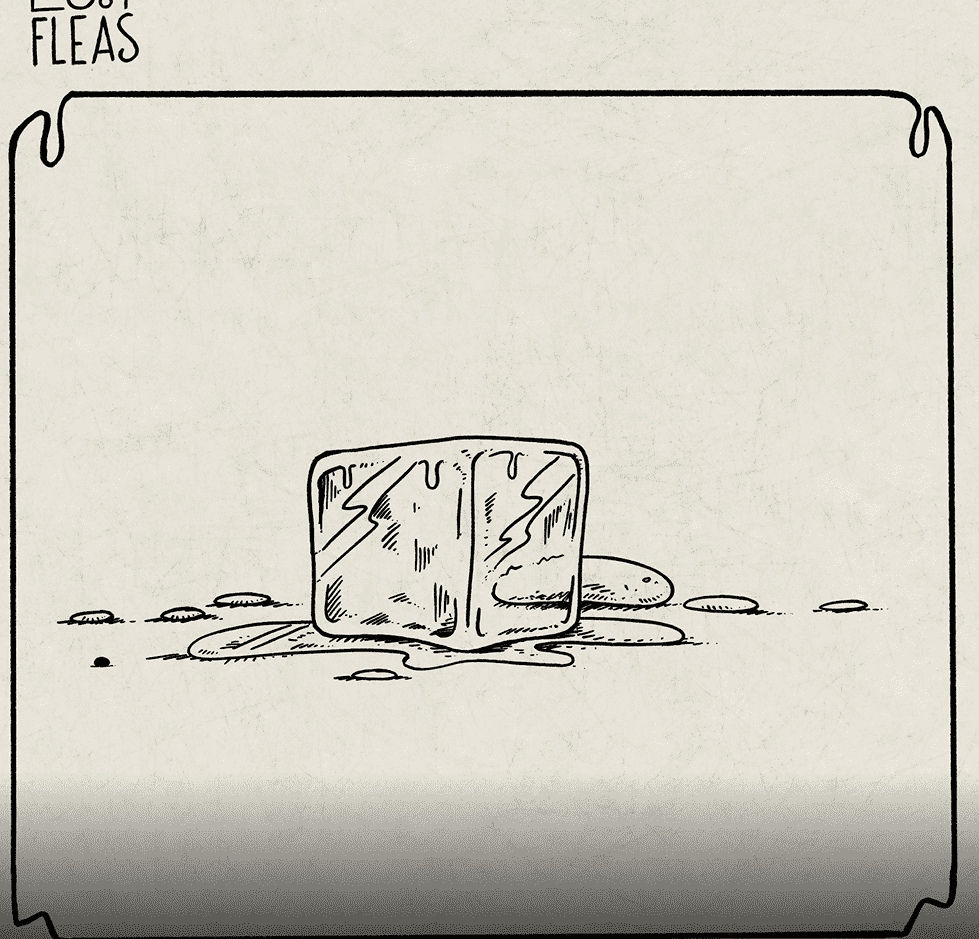

# The Lost Fleas

创建者 JrCasasEach Flea 是在以太坊区块链上铸造的独特 1/1 动画 NFT 描述包括找到每个人的坐标以及了解它隐藏的角色或故事的一些线索。你准备好收养跳蚤了吗？

The Lost Fleas 是一系列有趣的跳蚤，每只跳蚤都是独一无二的，在世界各地都有发现，其中许多已经被单独留下，悲伤和无助。
现在他们住在以太坊区块链上。并且正在寻找一个家。
你准备好收养跳蚤了吗？
是什么让这些跳蚤特别？
它们是现在生活在区块链上的第一批跳蚤，这是必要的，因为钱包里装满了这么多动物……一定有跳蚤……

每只跳蚤在其描述中都包含了它被发现地点的坐标。
一些跳蚤隐藏了一些关于一个地方的信息，或者一个特殊的字符......等等......

