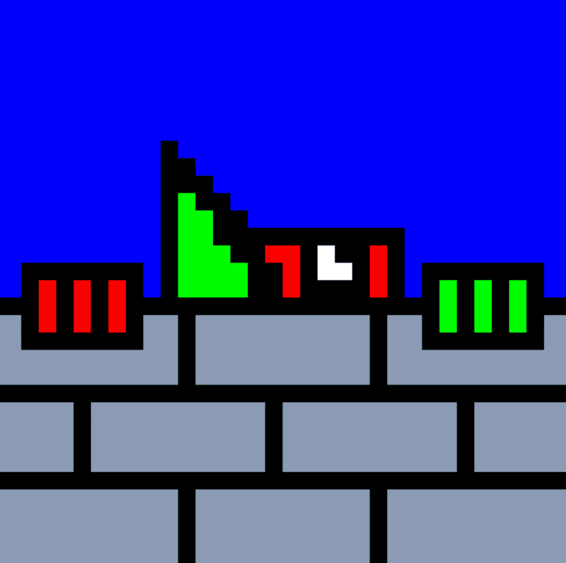

# The Lurkers

潜伏者在初级阶段已售罄！对于个人资料图片，潜伏聊天并只是一般地表达自己。 100 个独特的、单独绘制的 1/1 在他们自己的 ERC-721 合同上铸造！ 他们是艺术！

Lurkers NFT - 常见问题（FAQ）
▶ 什么是潜伏者？
Lurkers 是一个 NFT（不可替代令牌）集合。 存储在区块链上的数字艺术品集合。
▶ 有多少个 The Lurkers 代币？
总共有 100 个 The Lurkers NFT。 目前，71 位所有者的钱包中至少有一个 The Lurkers NTF。
▶ The Lurkers 最贵的拍卖品是什么？
The Lurkers NFT 售出的最贵的是 Lurker 03。它在 2022 年 8 月 2 日（29 天前）以 35.2 美元的价格售出。
▶ The Lurkers 最近卖出了多少？
过去 30 天内售出了 3 个 The Lurkers NFT。

