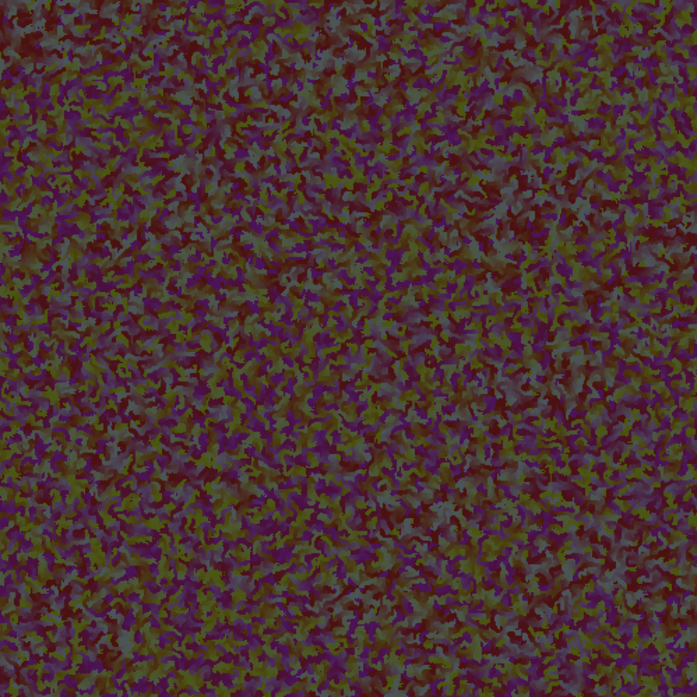

# The Meld OmniChain

第一个 OmniChain Gen Art - 完全确定性 - LayerZero 使 NFT 能够被铸造或转移到以下任何链：ETH、BSC、MATIC、AVAX、FTM、Arbitrum、Optimism。

Meld OmniChain NFT - 常见问题（FAQ）
▶ 什么是 The Meld OmniChain？
Meld OmniChain 是一个 NFT（不可替代令牌）集合。 存储在区块链上的数字艺术品集合。
▶ 存在多少 The Meld OmniChain 代币？
总共有 250 个 The Meld OmniChain NFT。 目前，62 位所有者的钱包中至少有一个 The Meld OmniChain NTF。
▶ 最近卖出了多少 The Meld OmniChain？
过去 30 天内售出了 0 个 The Meld OmniChain NFT。
▶ 什么是流行的 The Meld OmniChain 替代品？
许多拥有 The Meld OmniChain NFT 的用户还拥有 REMO x DCsan 的 Dream Engine、BlockMark Gems、Dear Hash、MODNAR WOLF 和 KOI POND | 玉桥一护。

