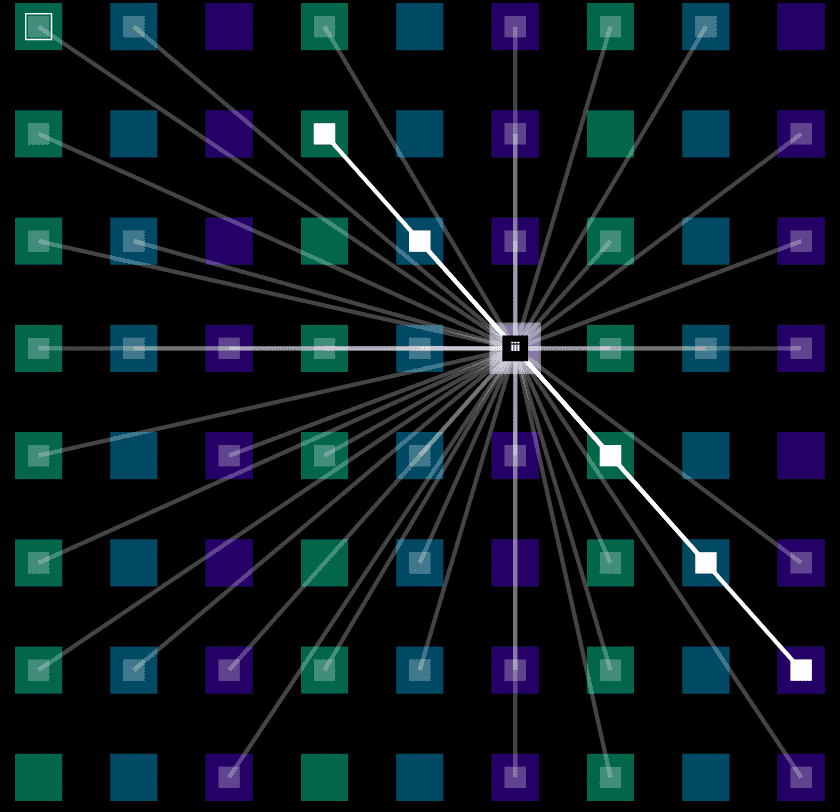

# The Mesh by Takens Theorem

“公共区块链中社会性的视觉表达。”初始销售的大部分收益（7.25 ETH）捐赠给了UkraineDAO和GiveDirectly。有关The Mesh的详细信息在这里。收藏家网站在这里。注意：刷新后，可视化会通过适应您的钱包而改变 .Recoverable (100% on chain)Summonable [reveal()]Composable (SVG) Evolvable (dynamic, can change)Interactive (owners can call contract)Terms and Conditions Mesh是一个实验项目，使用风险自负。 每个令牌均按原样和可用状态提供，没有任何和所有保证。 通过使用合同，您对涉及 The Mesh 的任何和所有交易承担全部责任。 与任何此类性质的项目一样，在部署和使用过程中可能会发现无法预料的错误或问题。 这些是重要的警告，但我希望

Mesh是一个小型NFT项目，它可视化了区块链数据固有的社交连接。每个可视化称为“节点”，并显示其所有者的某些属性，例如其所有者拥有多少NFT（背景大小和颜色），以及该所有者何时具有与The Mesh上其他所有者相似的NFT（显示跨令牌的连接）。但The Mesh远不止于此。它是社交网络，DAO和NFT的融合，以创建一种集成的链上体验...

