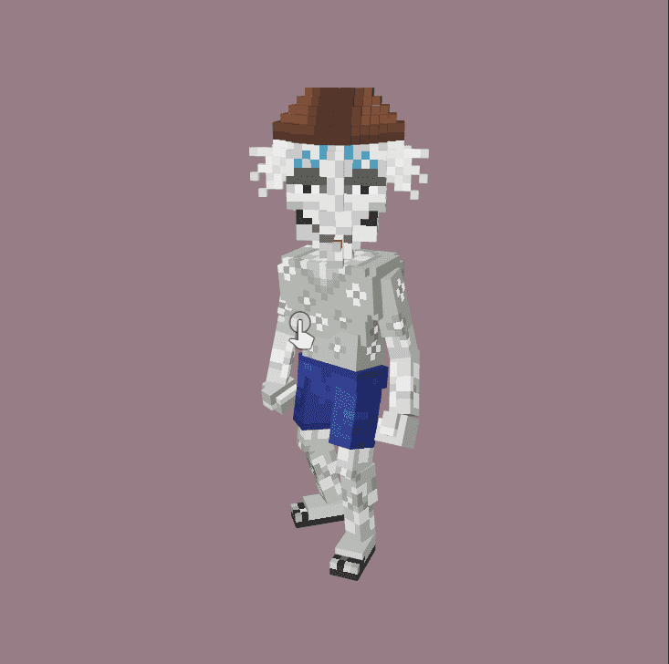

# The MonstroCities

经过怪物城市
MONSTROCITIES VOXELS 已上线 MonstroCities 是第一款真正的社交化身虚拟世界游戏。 MonstroCities 是 SandBox 的官方合作伙伴，在 The Sandbox 拥有一个 6x6 的庄园。MonstroCities 是 8,000 个独特的 NFT 的集合，由四个生活在以太坊区块链上的元素怪物文明组成。每个怪物都是由大约 400 个配件（每个文明 100 个）以编程方式生成的，以确保它们都是完全独一无二的。 每个怪物都将是 Sandbox 中 MonstroCities 元节游戏中的一个角色。

怪物城是8，000个生成怪物，居住在四个2000人口基于元素的文明中。

每个怪物都是他们自己的体素角色，可以在我们的元宇宙伙伴沙盒中玩！

