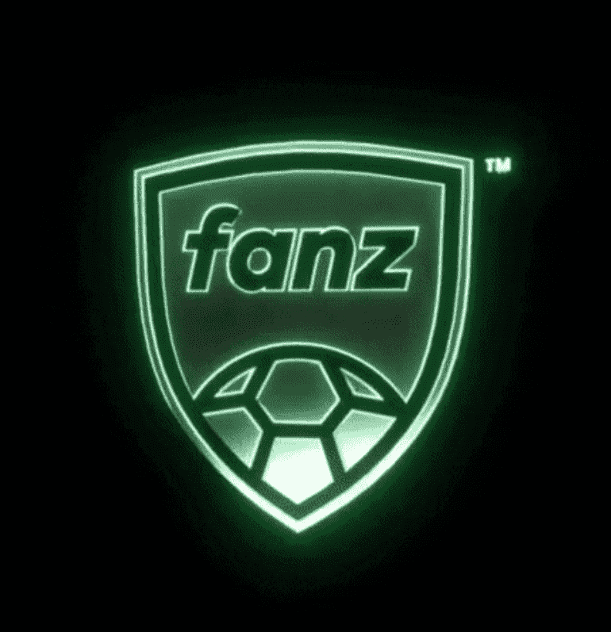

# THE MOTTY COLLECTION

收集来自 John “MOTTY” Motson 的 5,000 个独特回忆，以庆祝他在 50 年的职业生涯中最喜欢的 50 场比赛。

Fanz是足球的技术平台，是球迷文化和区块链的交汇点。

通往NFT、游戏和治理的门户。网络足球3.0。

Fanz总部位于曼彻斯特，拥有20，000平方英尺的数字画廊，旨在为玩家，俱乐部和版权所有者提供访问区块链的交钥匙解决方案。

“下一代球迷不会成为客户。他们将成为所有者。这就是范茨的愿景。

Sam Jones，Fanz的创始人。

Fanz Fantasy5是一款在浏览器上免费玩的游戏，用户可以从英超联赛的5场比赛中选择5名球员。

根据球员在联赛每轮比赛中的真实表现，每轮比赛后都会有一个记分牌显示获胜的比分。得分最高的球员将获得精英球员的NFT或签名商品。

