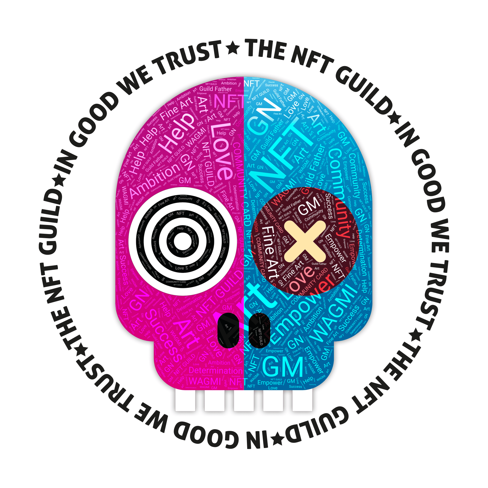

# The NFT Guild

头骨是字面上隐藏真实身份的东西。唯一一个被感知为“我”的地方正在被创造。大脑。点燃情绪，思想，分析和决策。每个人的头骨几乎都是一样的。内部，大脑和外部，皮肤，是创造差异的原因。然而，我们可以了解到，不是内在的，也不是外在的，会影响我们如何看待彼此。那些拿着头骨的人被称为家庭，是这场运动的核心。
这套在没有事先宣布的情况下以每套约11美元的价格被放弃。它在4天内售罄。
目前的持有者名单概述如下。

NFT不是用于投资的，也没有它们持有或随着时间的推移而获得价值的任何保证。请在购买NFT艺术品或收藏品时进行自己的研究。使用本网站或从本网站或任何市场获取NFT公会相关项目，即表示您根据自己的判断接受所涉及的所有风险。

