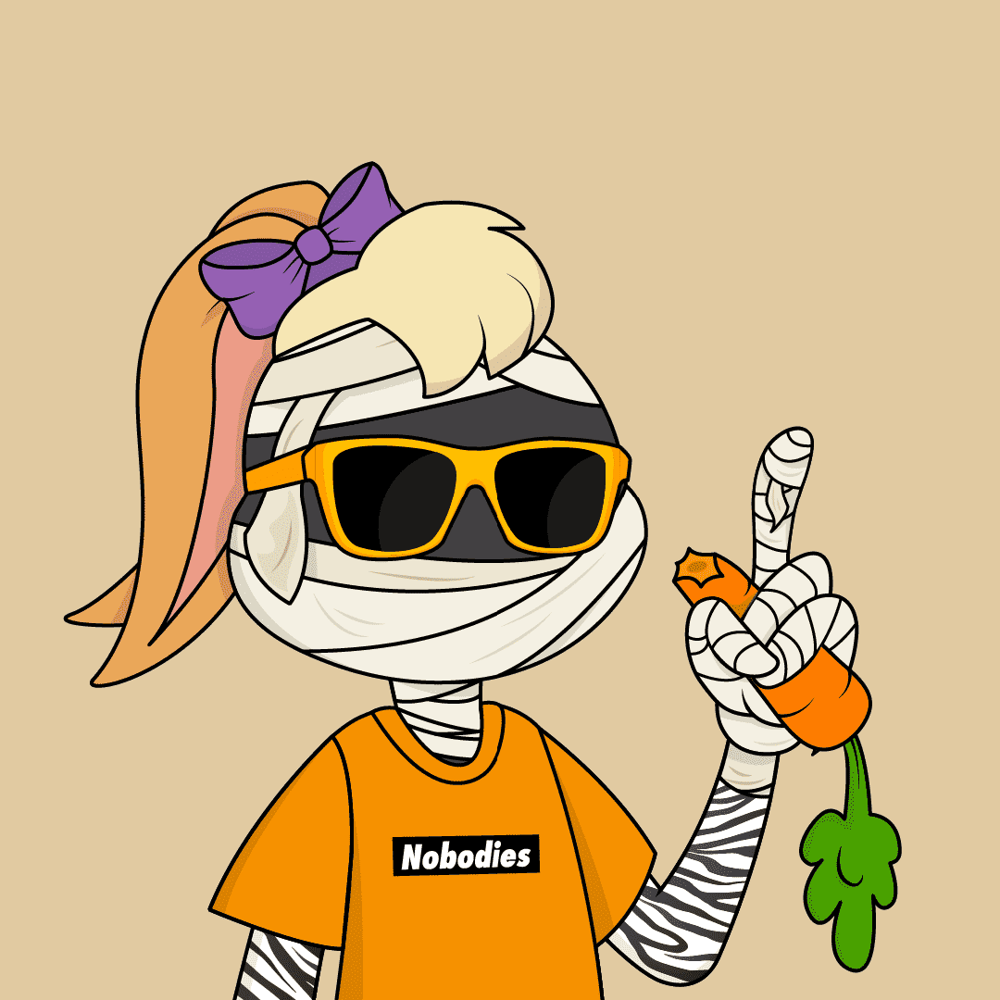

# The Nobodies Club

Nobodies Club 是 1,000 个 Nobodies NFT 的集合，汇集了各行各业的人们。 拥有Nobody 后，会员可以获得独家指导、认证计划、项目合作、人力资源和增长联系网络。前500 名Nobodies 将被释放以进行初始铸造，其余500 名Nobodies 将被保存在保险库中 定期小供应铸币。

什么是无名小卒俱乐部？
Nobodies Club 是一个 NFT（非同质代币）集合。 存储在区块链上的数字艺术品集合。
▶ The Nobodies Club 代币有多少？
总共有 500 个 The Nobodies Club NFT。 目前，235 位车主的钱包中至少有一本 The Nobodies Club NTF。
▶ The Nobodies Club 最贵的交易是什么？
最昂贵的 The Nobodies Club NFT 是 The Nobodies Club #326。 它于 2022-06-10（3 个月前）以 23.3 美元的价格售出。
▶ The Nobodies Club 最近卖出了多少？
过去 30 天内售出了 1 个 The Nobodies Club NFT。

