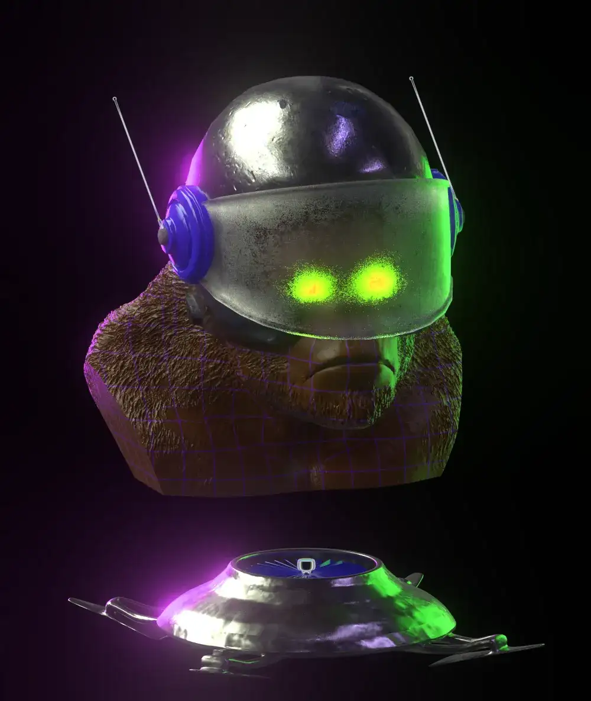

# The Non-Chimpz Headz

Non-Chimpz 是 1214 只 3D 黑猩猩的集合，它们超越了可悲的起源。官方网站：nonchimpz.comNon-Chimpz 作为 ERC-721 代币存储在以太坊区块链上。Non-Chimpz 已做好充分准备，配备各种配件、神奇的效果、 服装物品、表情和超过 220 种可能的特征。 非黑猩猩具有 11 种非视觉特征的所有不同组合。

非黑猩猩是那些不是黑猩猩的黑猩猩——因为它们选择成为更多的东西。黑猩猩多年的训练和研究使它们成为其数字物种的顶点标本。

“NON”是一个首字母缩略词，意思是“高贵，杰出和臭名昭着”，与典型的哺乳动物兄弟相比，捕捉了非黑猩猩的特殊性质。每个人都是高尚的品格，杰出的能力，在丛林中臭名昭著。

成为卓越的人始于正确的心态。Non-Chimpz于2021年11月推出，在以太坊区块链上作为1214个独特的头像和数字收藏品提供。

