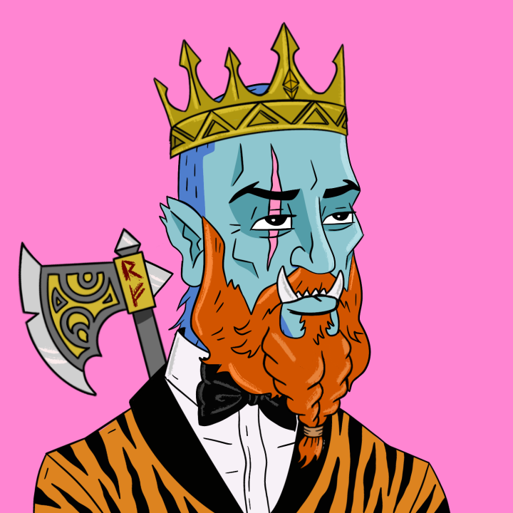

# The Nordic Society NFTs

这就是北欧社会！ 这是我们精英氏族维京战士协会的名称。 我们生来就是为了突袭、征服和扩展整个 WEB3。 我们吵架！！ 我们盛宴，我们喝酒！ 斯科尔尔！！

The Nordic Society NFT 的总销售额为 147.11 美元。 一个 The Nordic Society NFTs NFT 的平均价格为 36.8 美元。 北欧社会有 452 名 NFT 所有者，拥有 1,587 个代币的总供应量。

什么是北欧协会 NFT？
Nordic Society NFT 是一个 NFT（不可替代代币）集合。 存储在区块链上的数字艺术品集合。
▶ The Nordic Society NFTs 代币有多少？
北欧协会共有 1,587 个 NFT。 目前，452 位所有者的钱包中至少有一个 The Nordic Society NFTs NTF。
▶ The Nordic Society NFT 最昂贵的交易是什么？
The Nordic Society NFT 出售的最昂贵的 NFT 是 TNS #123。 它于 2022-06-23（2 个月前）以 87.8 美元的价格售出。
▶ 最近卖出了多少 The Nordic Society NFT？
过去 30 天内售出了 7 个 The Nordic Society NFT NFT。

