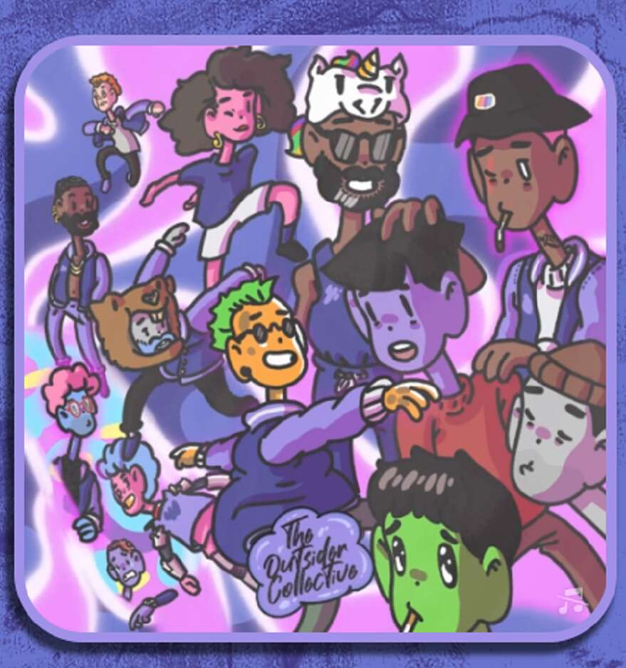

# The Outsider Collective

The Outsider Collective 是一个由跨越艺术和音乐学科的 web3 本地创意人员组成的团队，他们齐心协力构建了一个基于创造力、社区和协作价值的生态系统。

关于我们
The Outsider Collective 是一个由跨越艺术和音乐学科的 web3 本地创意人员组成的团队，他们齐心协力构建了一个基于创造力、社区和协作价值的生态系统。
该团队作为失败者俱乐部的持有者聚集在一起，因此与该项目有着密切的联系。 The Outsider Collective 推出的第一部作品是 Loser Club 的第一张 pfp 社区混音带。 所有提交的音乐都是 Loser Club NFT 持有者之间的合作，甚至包括对磁带的混音和母带处理。 最终曲目列表由 Loser 社区投票选出，创始艺术家 J'von 创作了封面艺术。 磁带的所有贡献者将在最终生产和销售的 NFT 中获得一级和二级销售的平分

