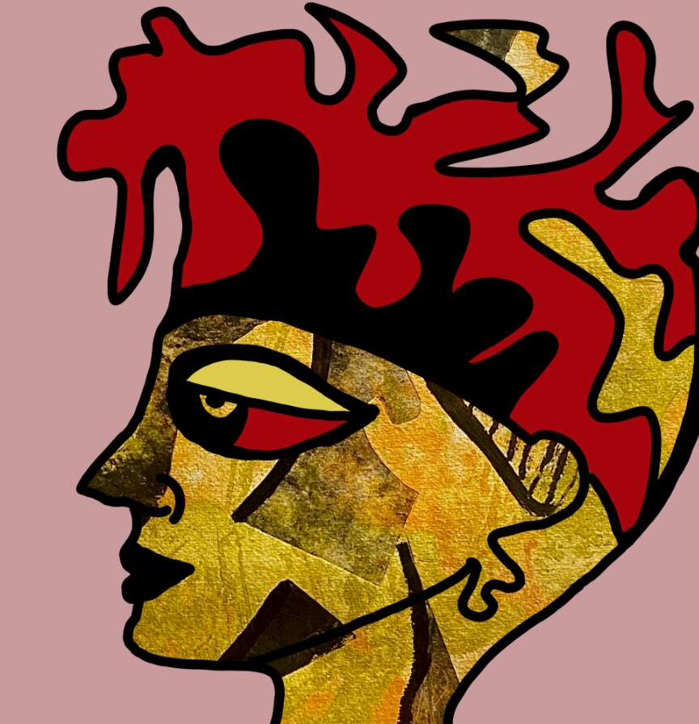

# The Outsiders genesis

局外人起源是由 Juliana Plexxo 创作的 222 位 1:1 手工制作的局外人艺术家的集合。适合真正收藏家的艺术品。 局外人将由 5 个系列组成，第一个系列（起源）由 Juliana Plexxo 创作，接下来的系列将与其他艺术家合作完成。 如果您有一件来自 genesis 收藏的作品，您将在以下收藏中获得奖励。我们在巴塞尔艺术展期间启动了该项目，在迈阿密艺术周 NFT 上，SLS 酒店的一个主要画廊展出了 Beeple 和 Smear balls 等顶级数字创作者。Genesis Collection 由以太坊区块链上的 222 个 1:1 NFT 组成。
每个 NFT 持有者将获得 Juliana Plexxo 制作的物理雕刻艺术作品。

