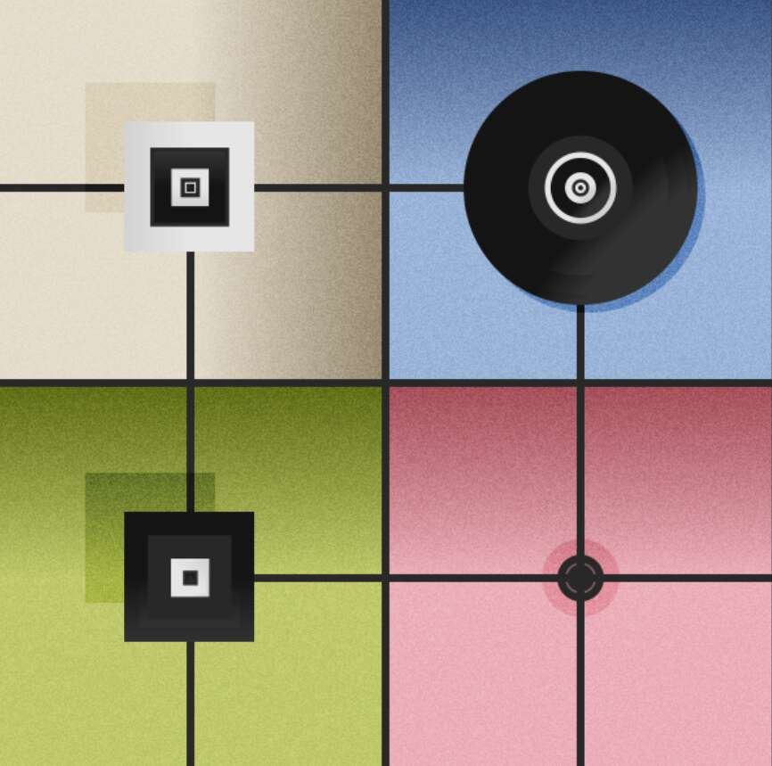

# The Panels

小组是一个关于集体智慧产生的实验。 它们是单个独立的生成艺术作品，由独特的哈希在薄荷上创建。 它们有不同的形状和颜色，其中一些可能会与其他人产生共鸣。 它们的灵感来自光线、声音和触觉的各个方面。 也有对其他生成艺术项目的参考。它由几个抽象元素组成，可以安排成更复杂和更有意义的体验。 这个项目还借用了博弈论和生物学的一些方面和元素。

该项目是 Arihz 和 Flamingo DAO 之间的合作，其他几个社区也参与其中：FingerprintsDAO、SquiggleDAO、NounsDAO、BeetsDAO、EmergenceDAO、BlockArt、Gen.art、PleasrDAO、Non-Fungible Heroes、SharkDAO、Nah Fungible Bones

