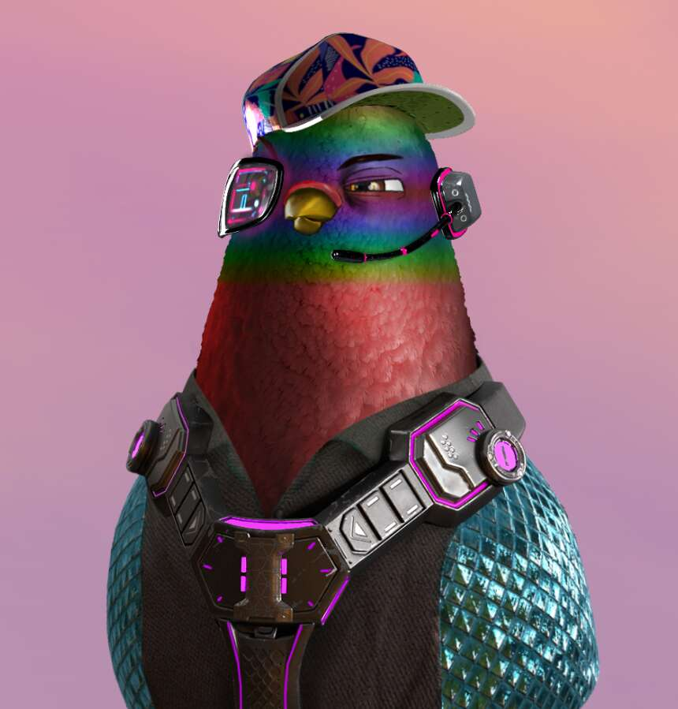

# The Pigeon Flight Club

鸽子飞行俱乐部是来自不断扩大的 CosmicFactions 世界的首个 NFT 系列，是由 10,000 只独特生成的古怪太空鸽子组成的复杂组合。 每一个 3D 渲染和雕刻的 Pigeon 都是独一无二的算法组装作品，由稀有度指标支持； 它永远不会被复制、没收或销毁。鸽子飞行俱乐部系列将具有专门的跨项目和跨平台功能； 并将在沉浸式、多社区的 CosmicFactions 世界中与未来派系一起使用，玩家可以在其中竞争获胜并获得奖励的机会。 CosmicFactions 将容纳无限数量的派系，每个派系都与特定项目挂钩，并拥有自己的个性化 PFP NFT 收藏。

