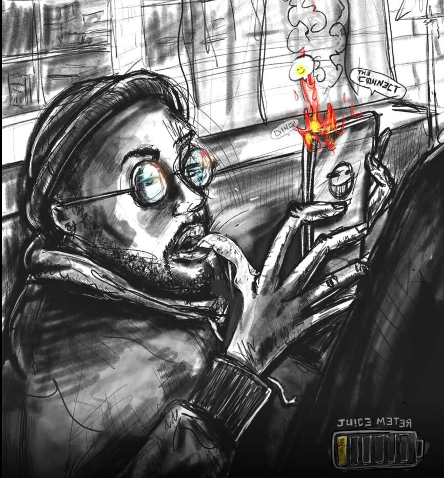

# the Plug by LOGIK

logik 的插头
LOGIK 离开圣路易斯追求梦想。 作为墙上的苍蝇到达芝加哥的现场，他在地下艺术场景中导航，并作为创新者在美国企业界崛起。 现在，他是一名跨学科的炼金术士，在下一代有远见的人之间建立黄金联系。

这个怎么运作
LOGIK 成为此 NFT 持有者的“插头”，其被编程为提供越来越多的利益（“果汁”），持有的时间越长。 保存在钱包中时，果汁水平每两个月不断增加。 一旦达到 100%，它将永远保持完全充电。 但是，如果未达到最大果汁，则在出售 NFT 时，果汁水平会恢复到 1%。

