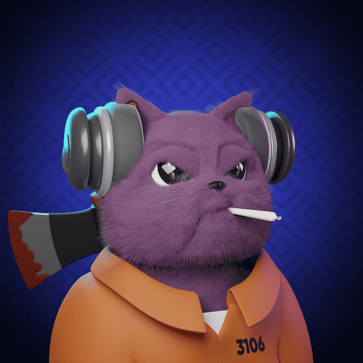

# The Project Cats Official

Project Cats 是存在于以太坊区块链上的 3,343 个随机生成的未来派 NFT 的集合。Project Cats 持有者可以参与我们的 DAO，并参与诸如空投、抽奖、社区赠品等活动。猫计划是未来，未来就是现在！ETH 区块链上的 3,333 个 HD-3D 项目猫。猫计划在街上引起了轰动！项目住房即将推出该战略是在我们的不和谐中宣布的。您想知道如何拥有[#ZAYC]版本吗？输入我们的不和谐并找出答案！2018 年，我购买了 10,000,000 个 Cardano 代币，然后完全忘记了它们。我今天在对我的加密资产进行全面审计时发现了它们。因为我不想持有 ADA，所以我会将所有 1000 万张赠予一个喜欢或转发此推文的随机人。

