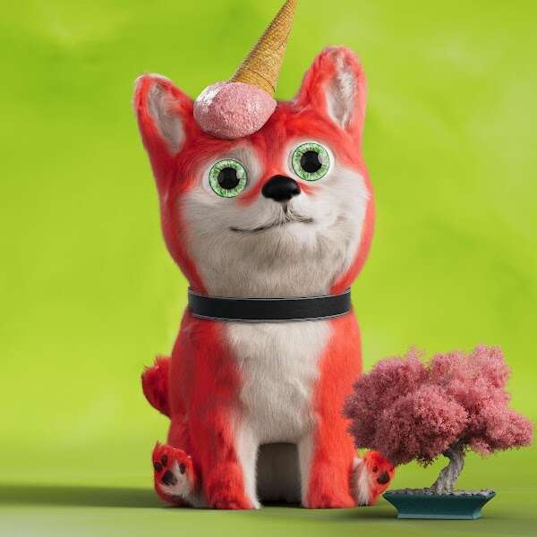

# The Puffy Paws Pack

Puffy Paws Pack 希望为不断发展的 NFT 生态系统带来积极的转折，由当红艺术家“NotEetu”设计的极其可爱的狗 NFT，为收藏家带来微笑。这是一个基于爱与尊重的社区，希望能在整个 web 3 世界掀起波澜。Puffy Paws Pack 是虚拟世界中最蓬松的生物。虽然他们的外表可能会欺骗你，但他们仍然充满了冲击力。
他们的持有者将享受 DAO、社区基金、Staking 等的好处。这些生物是你在元宇宙中最好的朋友，为你提供充足的陪伴。与普通狗不同，这些狗不会变老，而是永远保持年轻。及时冻结 - Puffy Paws 包在被冻结 14,200 年后仍然存在。他们最终将获得自由并探索社会的城市化领域。每个 Puffy Paws Pack NFT 都在寻找会爱护和照顾它们的新主人。它们由 8 只顶级犬带领，顾名思义，它们是用知识指导同伴幼犬的佼佼者。Top Dogs 是最独特的艺术品，每一件都是一件一件的作品，你可以从数英里之外看到他们的领导相似之处。

