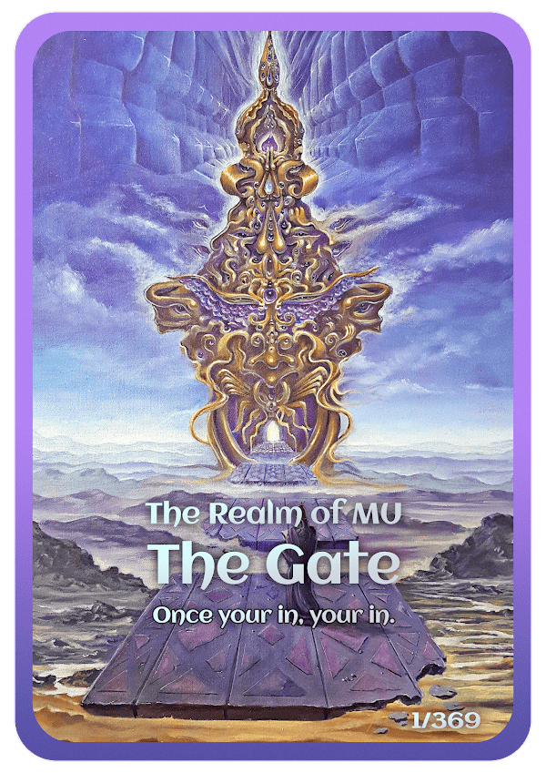

# The Realm of MU

穆之境没有人知道穆国的历史有多久，但如果传说是真的，它在时间之前就已经存在了。一个真正永恒的地方。众所周知的是，很少有人访问过这个领域，他们所报告的经历是莫名其妙的。仿佛被这个地方的美丽所震撼，人们发现很难保留他们访问的任何记忆......该领域由许多流体层组成。由人类认为无非是上帝思想的表现形式组成。领域由所谓的“桥梁”守卫。引导他人通过这个能量领域的超自然实体。经过 传送门，第一次接触界域……找到传送门并不容易，但要通过它就更难了。放开自己和恐惧是到达另一边的唯一途径。这张卡是 The Realm of MU 项目的一部分，可让您访问将于 2021 年第三季度发布的 3D 小游戏。

