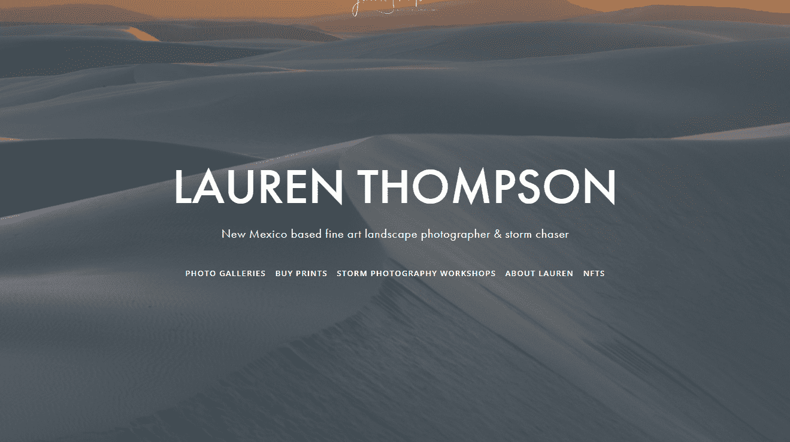

# THE RECKONING Editions by Lauren Thompson

2022 年 4 月 21 日，堪萨斯州罗泽尔：夜晚召唤了这个美丽的、缓慢移动的低降水超级单体（我见过的第一次 LP 风暴），夕阳的笔触轻轻地消失在蓝色的时刻。它以悠闲的速度在天空中爬行，向着这座风化的谷仓越来越近，每一分钟都变得越来越不祥。突然，一道扭曲的闪电在上升气流中沸腾，从云层中迸射而出，饥渴地伸向天地，像是从内而外的清算。

THE RECKONING 版本是使用 Manifold 和 ERC 721 代币标准铸造的。每个版本都有一个唯一的 ID，总共 30 个。

许可证：主要 NFT 持有者可以免费用于广告、私人展示和团体展示，包括 NFT 持有者的虚拟画廊、纪录片和散文，只要创建者被记入贷方。不提供创作商业商品、商业发行或衍生作品的权利。

