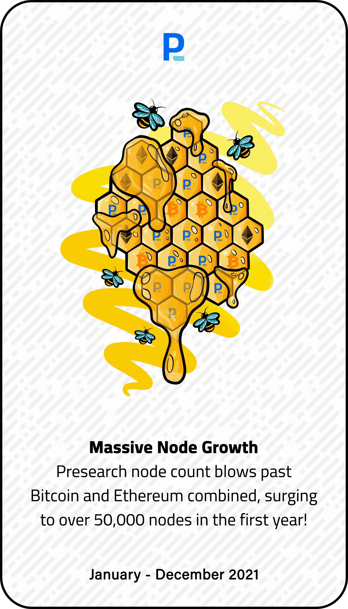

# The Road to Mainnet

“通往主网之路”系列是对 Presearch 去中心化搜索引擎的起源和历史的庆祝，直至其主网发布。

在 Presearch 主网启动之前，该集合已分发给主要 Presearch 社区成员——搜索者、节点运营商、广告商、代币购买者和持有者——。Presearch 节点数量超过比特币和以太坊的总和，第一年飙升至 50,000 多个节点！Presearch 是一个去中心化的 搜索引擎Presearch 正在构建一个完整的生态系统来支持 PRE 代币，并为世界提供一个由社区提供支持的去中心化搜索引擎，为社区服务。

生态系统包括：预研令牌去中心化搜索引擎预搜索节点关键词质押预研市场以太坊区块链私下搜索，获得更好的结果并获得由区块链技术提供支持的 Presearch 去中心化搜索引擎的奖励。

