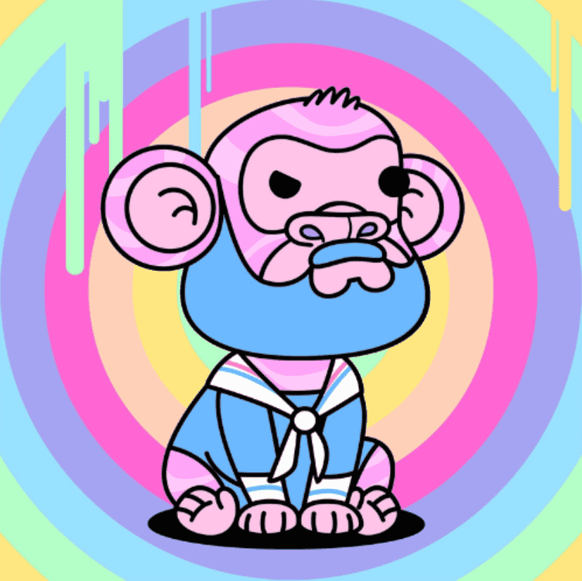

# The Scribbles NFT

Scribbles Club 是一个以社区为重点的衍生 NFT 集合，包含 9,999 个稀有 Nft。每个 1Scribbles Club NFT 都是使用 140 多种属性（如帽子、眼睛、皮肤等等）的组合算法生成的！Scribbles Club NFT 在以太坊 (ETH) 区块链上推出，旨在以可承受的价格提供高质量的艺术品，同时执行广泛的路线图。独家涂鸦俱乐部Scribbles 是生活在以太坊区块链上的 3333 只小猴子的多彩衍生集合！该项目定于2022年1月30日启动。自 2021 年 2 月起成为 NFT 爱好者，Liam 是该项目的 Discord 经理。在空闲时间，Liam 喜欢游泳和与他的狗 Samba 玩耍。

