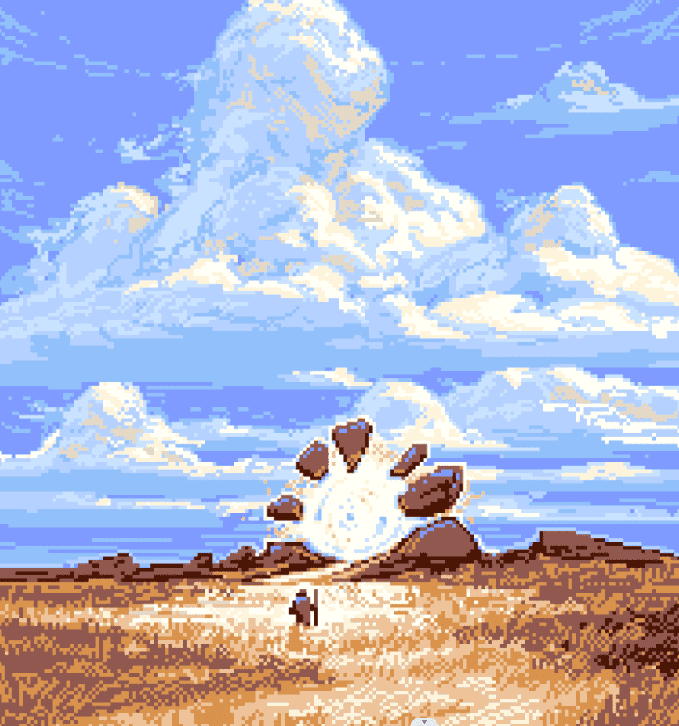

# The Sin of Man - Pixel Series

我们旅程的黎明，带来欢乐和痛苦。她刺眼的光芒，是春天的第一缕暖风，她触动了梦想和苦难的火花。我们诅咒、赞美和歌唱她的恩赐。大山必将升起，愚者也将因此而生。一个看不起我们并哀悼的母亲。我是[Noah Bradley]，《人的罪》是一个我正在创造、设计、绘画和写作的世界。这是一个原始的幻想世界，充满了阴暗的神秘、不知名的巨人和流浪的游牧民族。

加入我的邮件列表中的 14,000 多个其他人，并跟随我建立这个世界。或者您可以前往[商店]购买印刷品、游戏垫和服装。

