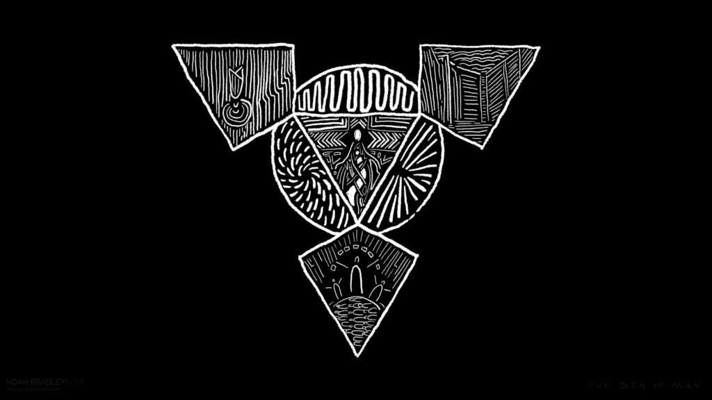

# The Sin of Man

我是[Noah Bradley《人的罪》是一个我正在创造、设计、绘画和写作的世界。这是一个原始的幻想世界，充满了阴暗的神秘、不知名的巨人和流浪的游牧民族。加入我的邮件列表中的 14,000 多个其他人，并跟随我建立这个世界。或者您可以前往[商店]购买印刷品、游戏垫和服装。和平时期最神圣的一天开始于在狭窄山谷中回荡的响亮的轰鸣声。冰霜紧贴在坚硬的地面上，但鸟儿仍在歌唱。他坐在垫子上，双腿交叉，闭上眼睛，掌心朝天。当最后的回声消失时，他让深沉的共鸣声音温暖了他。神殿之下和神殿中的水池和河流在柔和的和谐中荡漾着。它们绕着岩石旋转，冰沿着水边生长。他感到风和瀑布的浪花让他感到寒冷。他起身滑过雕刻的柱子，来到他的房间。他的兄弟姐妹们在房间里排成一排，开始他们的日常冥想。他们寻求通往和平的道路。

