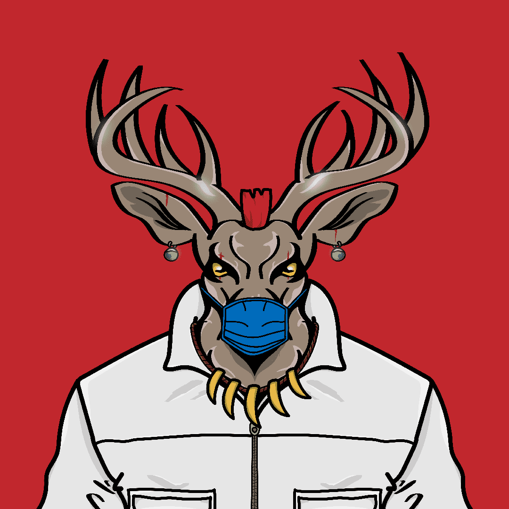

# The Stag Gaming Club

一个由 10,000 名 Stags 组成的社区，将游戏玩家、主播和游戏开发者聚集在一起。一个分享想法、获得帮助、展示您的技能并结交新朋友的社区。10,000 只雄鹿在现代保持传统活力我们长期致力于建立一个回馈社会一个游戏玩家、主播和游戏开发者社区，旨在帮助人们学习、成长和结交新朋友。在您的独立游戏中遇到问题，请向社区中的其他开发者寻求帮助。

认识其他主播、合作并互相帮助。比起给大牌主播小费，对他们来说，给新主播打赏或关注的价值要高得多。帮助彼此共同成长，并给出改善的好建议。游戏玩家、结交新朋友并在社区中举办锦标赛。

