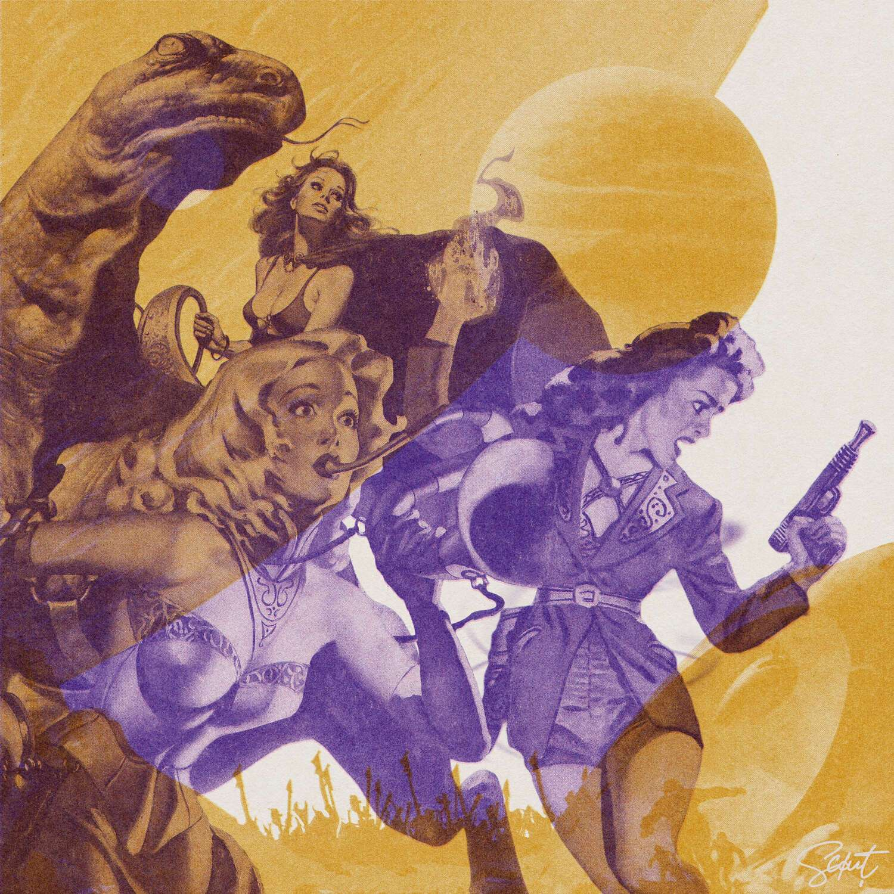

# The Starcrossed

Starcrossed 是从 1930 年代纸浆科幻开始的一系列拼贴剪纸艺术，采用立体印刷风格这是一个 nft 项目，不是程序生成的艺术，而是由不同元素手工制作的混搭，我将艺术拼凑、剪裁、设计和修改以创造新的东西。这是一种很酷的方式来庆祝过去的艺术，以及存档和记录它，并向能够欣赏它的新一代展示它。广告阿斯特拉你走到那个女人身边，各种不同的电子嗡嗡声和噪音的嗡嗡声随着你的动作变得越来越响亮。“啊！你要不要试试这台放大机？真是科学的奇迹！那位女士狡黠地说道。“当然不是谁都能用的，你需要一个特殊的令牌才能使用它……”

