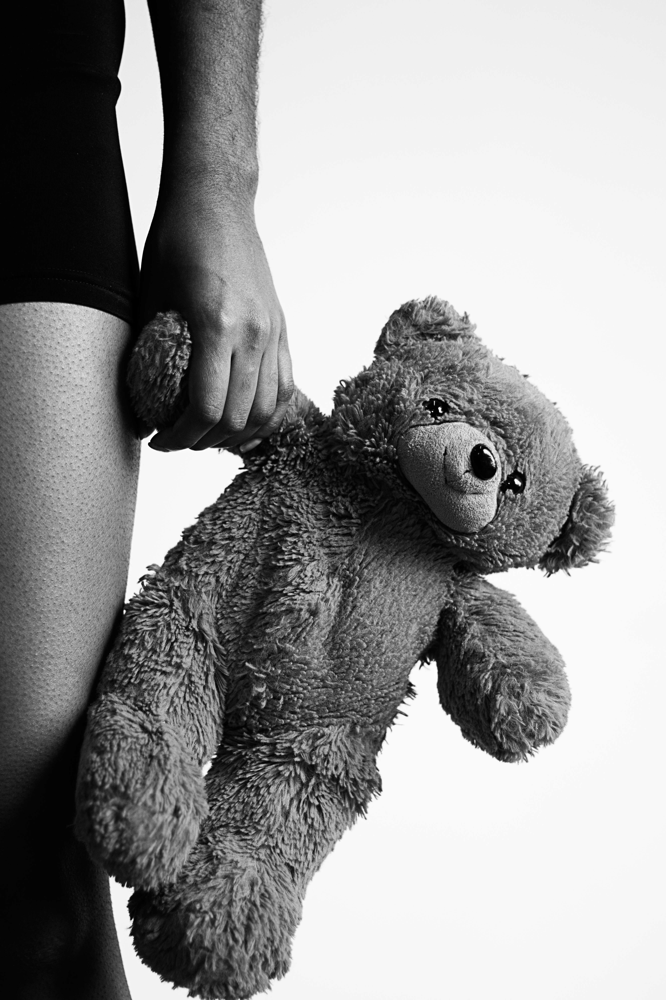

# Amani Sodiq- The Story of Us

“我们的故事”是我在 2019-2021 年间拍摄的 4 个独立美术摄影系列的 10 幅作品集。每张照片都有其独特的标题，代表了我在与抑郁和焦虑作斗争时生活的不同阶段。尽管关于心理健康的讨论在我们的社会中变得越来越普遍，但精神疾病患者所经历的痛苦的细节仍然不为人知。通过为我在抑郁发作期间所经历的强烈情绪和孤立带来光明，我希望其他人能够找到慰藉并被提醒他们并不孤单。尽管你很挣扎，你还是值得被爱的。Amani 是一位居住在德克萨斯州达拉斯的尼日利亚裔美国美术摄影师。她出生在德克萨斯州的欧文，但童年的大部分时间都在尼日利亚的拉各斯度过。2016 年，她回到得克萨斯州，并在发现难以融入美国文化时转向摄影。

