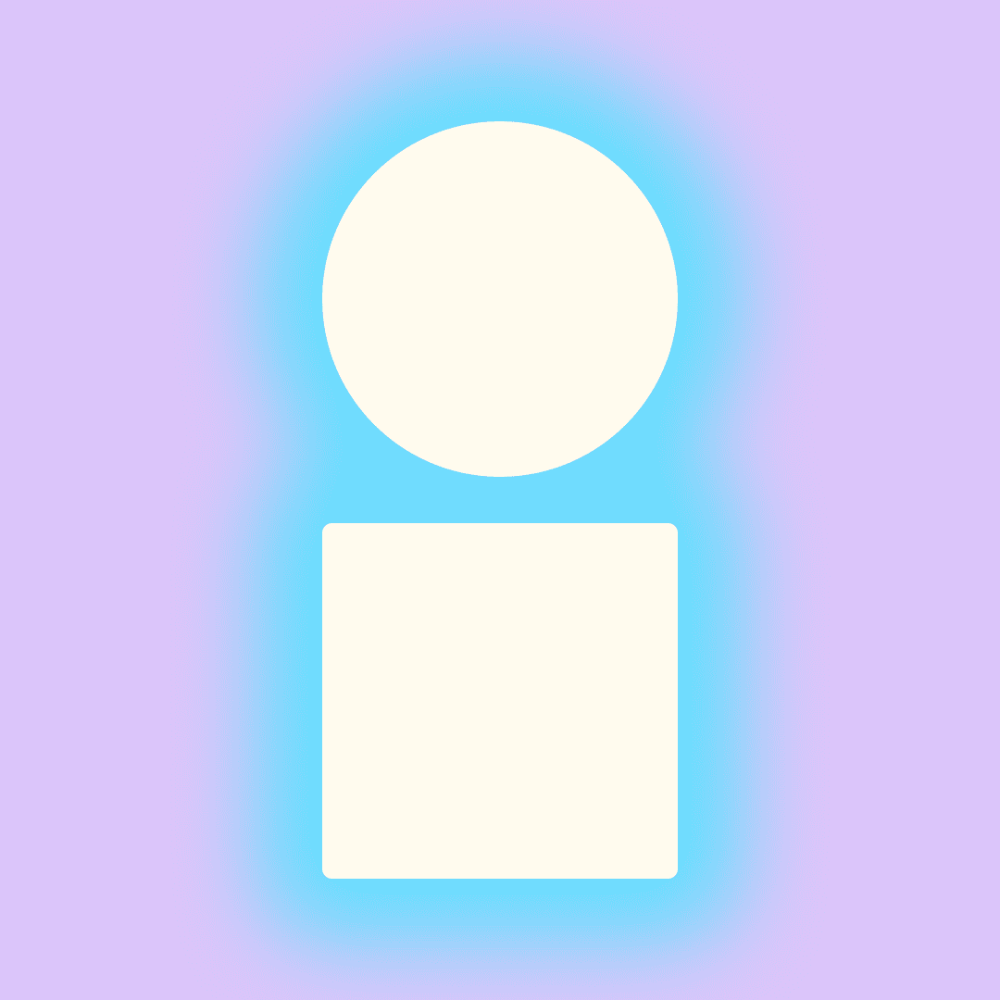

# The Symbols NFT

我们的感知创造了我们的现实。有些人只会看到眼前的世界，而另一些人则意识到存在于我们所见之外的真相。

一个生成的 NFT 集合，由来自 The Symbols 字母表的 26 个字母的独特变体组成，为社区构建并由社区构建。这是一个参与定义语言可以和应该是什么的机会。

仔细选择，因为这些字母是更大的构建块......我们的感知创造了我们的现实。有些人只会看到眼前的世界，而另一些人则意识到存在于我们所见之外的真相。

一个生成的 NFT 集合，由来自 The Symbols 字母表的 26 个字母的独特变体组成，为社区构建并由社区构建。这是一个参与定义语言可以和应该是什么的机会。

语言超越了语言，因此我们正在积极努力将我们的语言整合到电影、电视、媒体、广告、音乐、美术和 Web3 中。解锁秘密信息、IRL 体验并改变我们看待眼前事物的方式。

