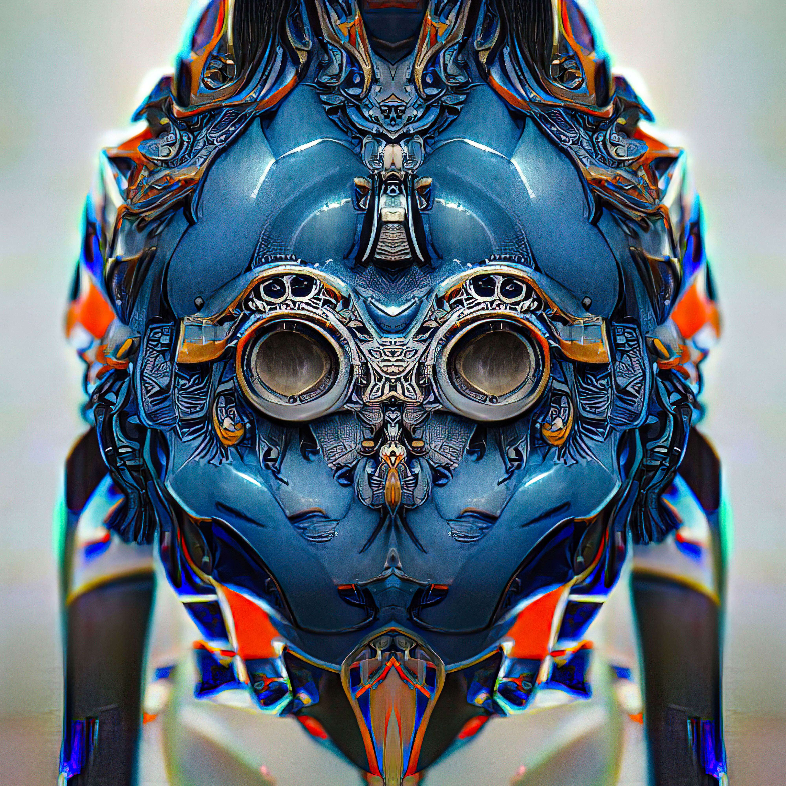

# The Symms

Symms [Mint Live] - 是 1000 种独特的、令人敬畏的生物，它们生活在以太坊区块链上。由 Harmeet Gabha 和 Alex Kess 在 Collab with AI 中一一创建。加入人工智能艺术革命！Symms 是 1000 个独特的、令人敬畏的生物，它们生活在以太坊区块链上。由 Harmeet Gabha 和 Alex Kess 在 Collab with AI 中一一创建。加入人工智能艺术革命！Symms 是生活在以太坊区块链上的神秘、令人敬畏的生物。每一个都是独一无二的；由 Harmeet Gabha 和 Alex Kess 与 AI 合作创建。Symms 是一种不同类型的 PFP 项目——人类与人工智能合作创造的对称生物——该项目庆祝奇怪、怪异和多样化。每个 Symm 都是完全独一无二的，通过文本字符串创建，然后由 AI 解释。在此之后，生成的图像被对称镜像、对齐和手动增强。这种对称性让人联想到的图像与罗夏墨迹测试的图像并无太大不同，在这种测试中，观众的解释与艺术品本身一样重要。

