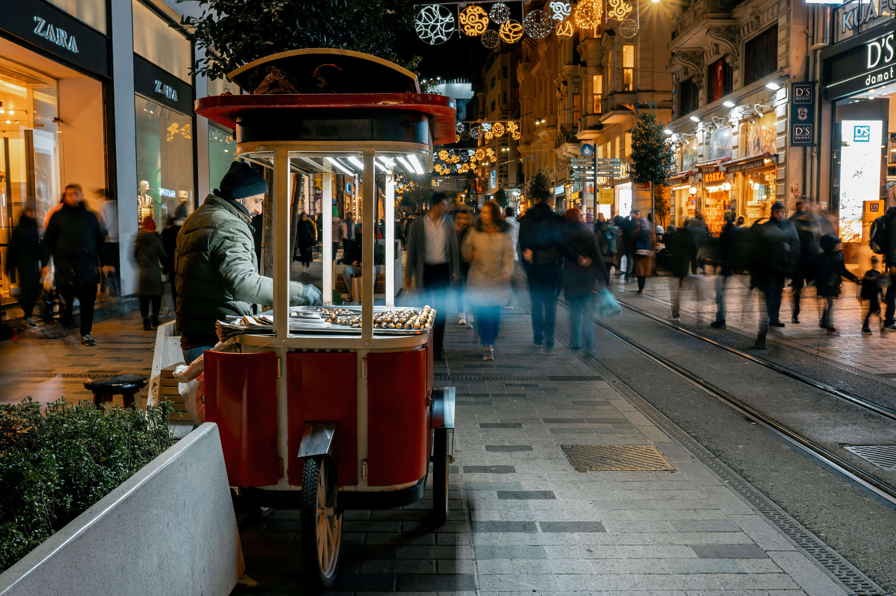

# The Unique One Ash Collection

在生活的混乱中，我们正在错过眼前独特的事物。有时这可能是一座建筑物、一个时刻或一个人。我的目标是根据这些独特的图像创建这个集合。世界的独特性总是在我们眼前。，我的新 B&W 系列在http://objkt.com发售！   这个系列的目的是让人们在等待奇迹的时刻永垂不朽。 0.25 ETH 您是否注意到父亲在我最喜欢的一张照片中满怀希望地看着他的孩子，兄弟会？等待 4/5 20 Tez 等待是希望。如果你有希望，你会期待奇迹在你的生活中发生。经过 [菲拉特雷姆齐古尔]这叫做怀旧。意识到你认为不快乐的过去时刻实际上是快乐的。在城市的混乱中，我们总是怀念眼前的独特。如果您想捕捉生活的独特性，请抬起头环顾四周。

