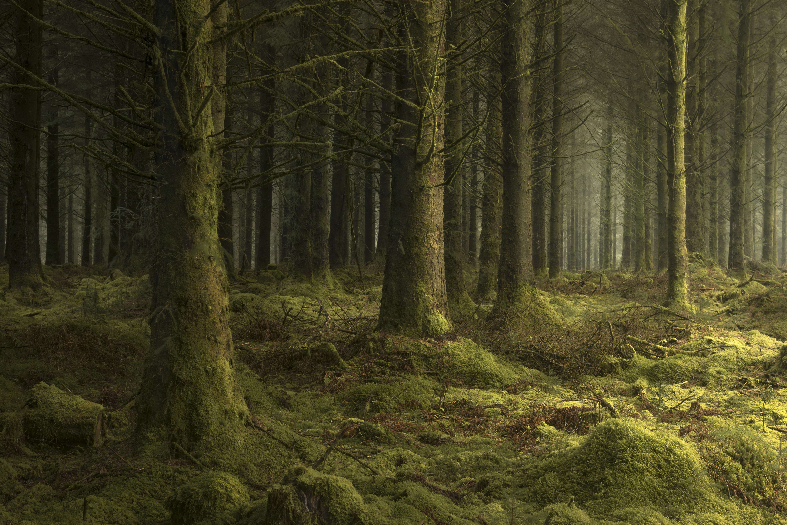

# The Unknown - by Neil Burnell

黎明的第一个小时，我一个人在想，浓雾笼罩着，一种诡异却震耳欲聋的寂静，没有一点声音。树木笼罩着我，它们若隐若现，它们还活着吗？

“The Unknown”是一组在英格兰拍摄的大气林地图像。每张照片都经过多次旅行精心计划，通常需要数月甚至数年才能制作最终图像。正在进行的系列深入研究达特穆尔的林地和英国的森林，每张照片都捕捉到了一个大气的时刻。

我去过的地方越多，我就越了解这些林地。探索每片林地的每一个角落，并冒险前往只有少数人探索过的难以到达的区域。慢慢地调整我的拍摄和处理风格以适应我现在很高兴在我自己的智能合约上发布这个集合的阶段。

