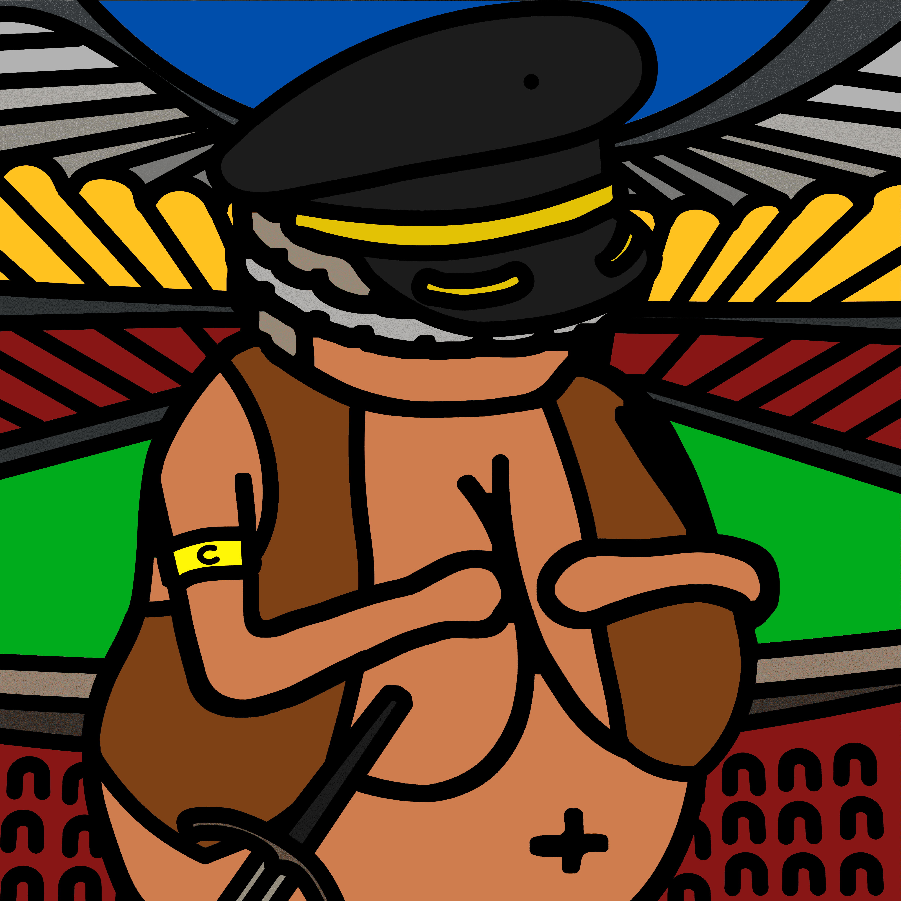

# The Venus NFT

受 25,000 年前一位艺术家的作品的启发，Veneres 在区块链上过着幸福的生活。Venus NFT 是 9,900 个独特的、随机生成的 NFT 的集合，由“The Venus Originals”集合中代表的元素组成。 在这个系列中，您会发现 Uncommon 和 Rare Veneres。您可以在“The Venus Originals”中找到 Epic 和 Legendary Veneres。再也不会铸造任何东西了。Venus NFT 是一个原始集合。Venus 是 9,999 个独特的、随机生成的 NFT 的集合，这些 NFT 存在于区块链上，其灵感来自 25k 年前一位艺术家的作品。让您自己探索这种在古代美的经典与现代生成艺术之间精心策划的融合

