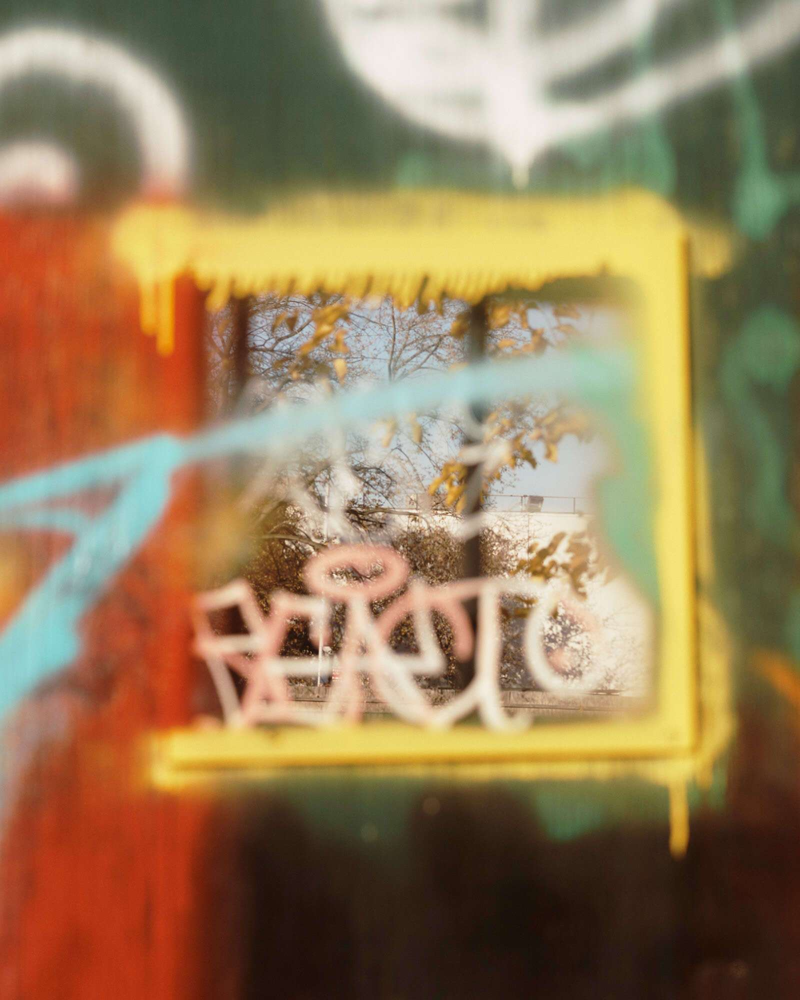

# The Views by Yael Malka

大会提出*意见*Yael Malka 拍摄的一组照片，标志着破坏与再生、忽视与奢华之间的空间。Malka 的图像唤起了人们对纽约市许多社区的豪华开发项目的关注，显示建筑工地以暴力的视觉语言开始。自 2013 年以来，纽约市每个建筑工地都合法要求 Malka 记录的观景板，为公众提供了这些工地的有利位置。在拆除和建造的不同阶段拍摄的几何剪裁变成了门户——既抹去又包围空间的空隙。通过对木制障碍物的抽象研究，马尔卡探索了公共与私人之间的界限。Malka 是布鲁克林的一位艺术家，他的作品曾在美国各地的众多场所展出。

