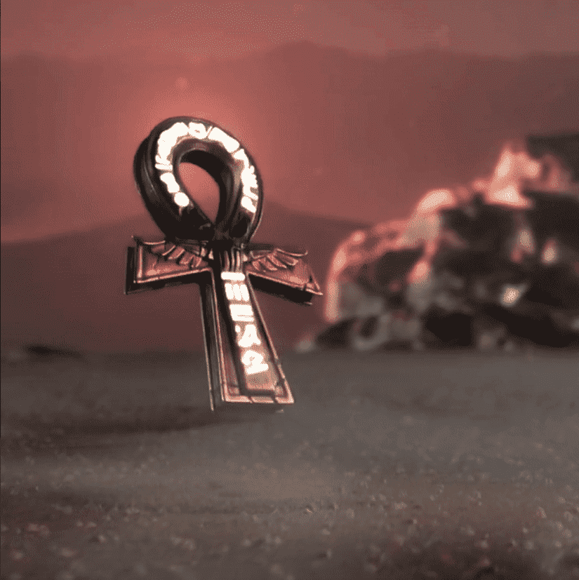

# The Warriors Of Ankh

背景故事很久以前，众神之战让埃及陷入一片废墟。寺庙倒塌，纯真消失了，众神也面临灭绝。经历了 5000 年的悲痛，埃及最后一位神阿塞特终于找回了丢失的安赫。有了它，她又一次让她的丈夫复活了。不过，他并没有一个人回来。通往冥界的大门已经打开。众神觉醒了，他们都想要一件事。永生的钥匙和统治这片凡人平原的力量。安卡。其他众神按照自己的形象赐予他们最优秀的战士，为战斗做准备，而阿塞特隐藏了十字章。众神之战开始了。任何派系都不会停止，无论代价如何。安卡在召唤...

