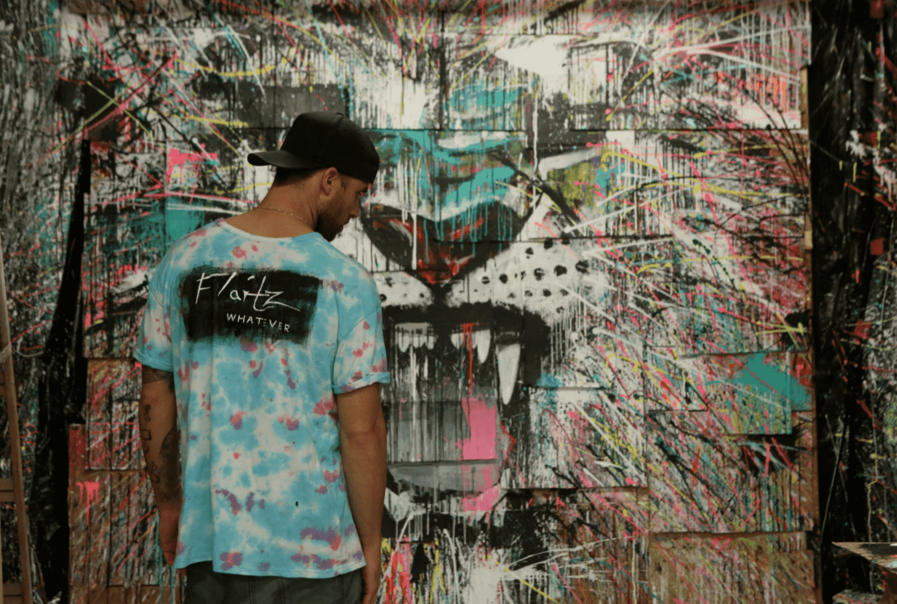

# The Whatevers

Flaitz Any 是一位来自洛杉矶的混合媒体艺术家。他以他的纸板艺术和做任何他想做的事而闻名。对于洛杉矶角色“Flaitz 不管”背后的艺术家和创意思维 Ryan Flaitz 来说，艺术一直是他最大的热情。瑞恩在纽约州西部的小城市霍内尔出生和长大。尽管他在一个小城市长大，但他总是以快节奏的心态与大城市联系在一起。受到大城市街头艺术和城市文化的启发，Ryan 从小就开始将他的灵感融入到他的作品中。

瑞恩的全职艺术家之路并不像大多数人那样传统。2007 年，Ryan 创立了现在流行的运动品牌 PSD Underwear。该品牌的服装以 Ryan 的原创设计和艺术品为特色。他花了十年时间在全国各地开发、启动和发展这家初创公司，直到瑞恩最终登陆洛杉矶，公司在那里取得了最大的成功

