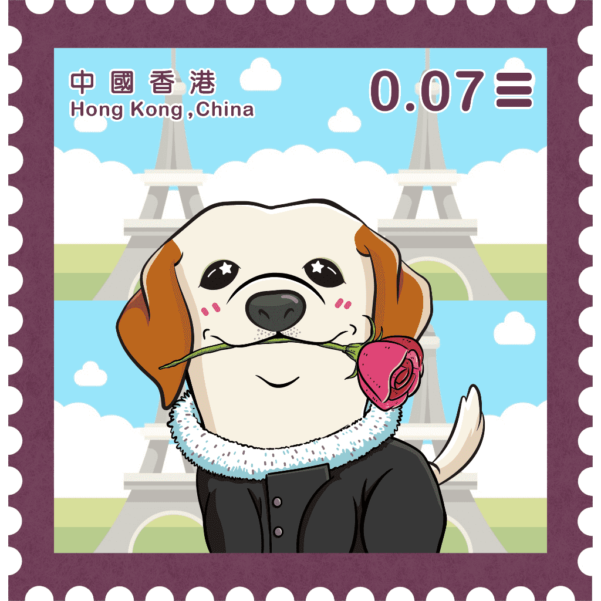

# THE WORKING DOG VOL.1

THE WORKING DOG，全球首个专注于工作犬的大型 NFT 项目。他们生来就肩负着成为人类伙伴的使命，并受过教育，可以利用他们的特征来帮助不同地点和职业的人们。第一波将包括限量版 3,388 个 NFT，展示 Seeing Eye Dogs 系列。1.首888位买家将获赠实物《THE WORKING DOG - 香港导盲犬首日封》作为纪念品2.THE WORKING DOG的40%的收入，不包括支出，将通过“NFT+ESG金库”捐赠给香港导盲犬服务（HKSEDS），以支持导盲犬的发展和首见香港具有国际标准的眼狗训练学校。3.狗眼中出现一颗流星，象征导盲犬不仅是人类最好的伴侣，也为视障人士带来爱与希望。

