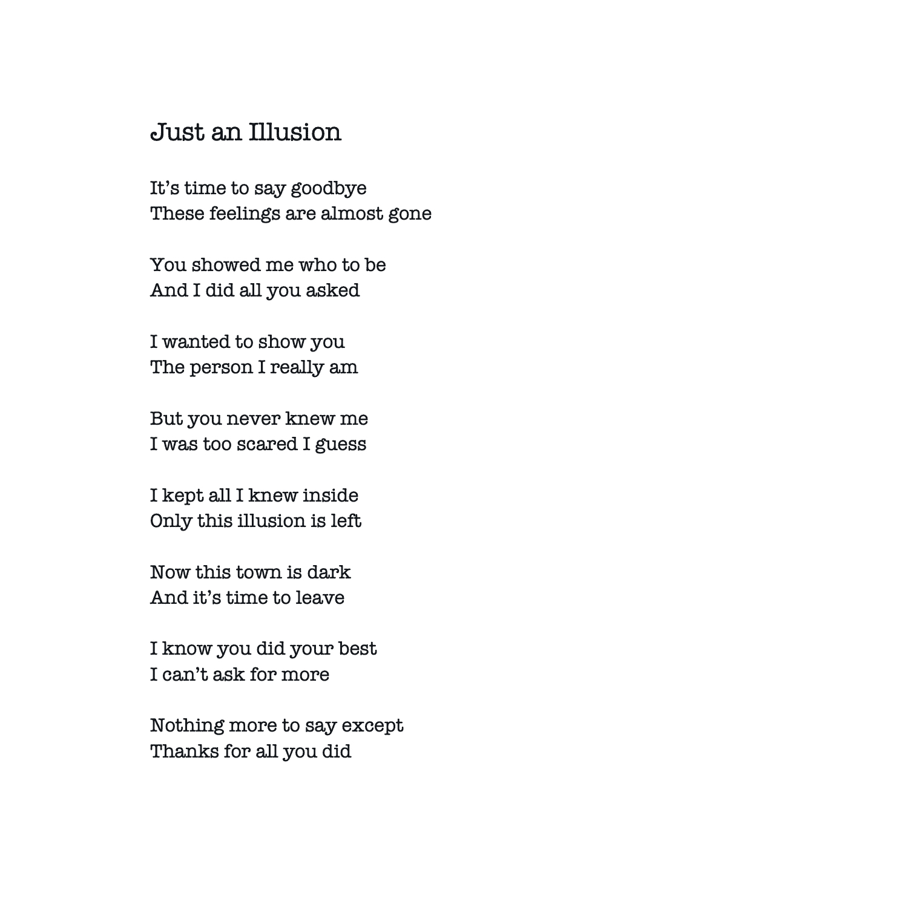

# The Written Word

The Written Word 是一本 1/1 诗集，传达了根深蒂固的情感。

Jamison Dove 的诗歌并根据 ERC721 合同铸造。文字 NFT - 常见问题 (FAQ)

▶ 什么是文字？

The Written Word 是一个 NFT（不可替代令牌）集合。存储在区块链上的数字艺术品集合。

▶ 有多少个 The Written Word 代币？

总共有 6 个 The Written Word NFT。目前 5 位所有者的钱包中至少有一个 The Written Word NTF。

▶ The Written Word 最近卖出了多少？

过去 30 天内售出 0 个 The Written Word NFT。一首关于关系虚幻本质的诗。

结构：对联

杰米森鸽子的 1/1 诗

