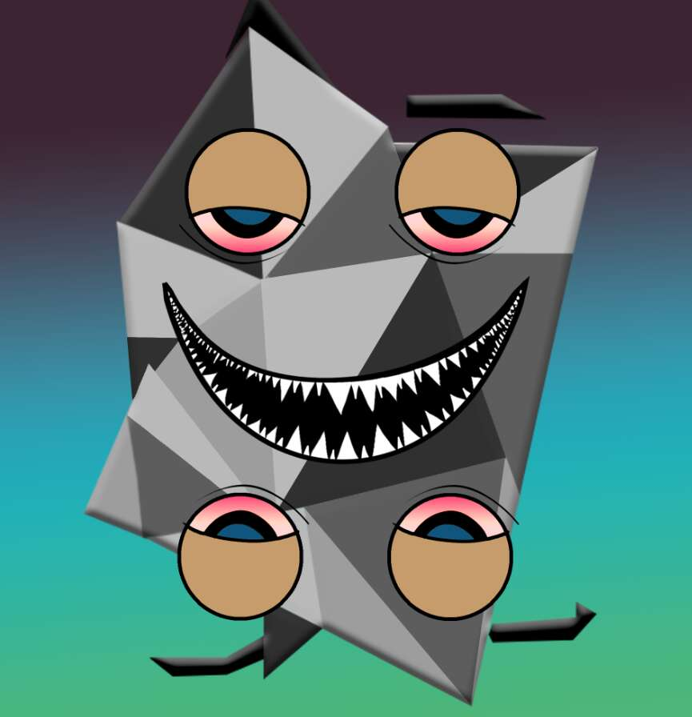

# The-Abstractions

Abstractions 是第一个在翻转时提供双重表达式的可逆 NFT。通过持有 Abstraction，您可以访问 Abstraverse 及其所有实用程序。

The-Abstractions NFT - 常见问题（FAQ）
▶ 什么是抽象？
The-Abstractions 是一个 NFT（Non-fungible token）集合。 存储在区块链上的数字艺术品集合。
▶ 存在多少 The-Abstractions 代币？
总共有 6,975 个 The-Abstractions NFT。 目前，530 位所有者的钱包中至少有一个 The-Abstractions NTF。
▶ 最近卖出了多少 The-Abstractions？
过去 30 天内售出 0 个 The-Abstractions NFT。
▶ 什么是流行的 The-Abstractions 替代品？
许多拥有 The-Abstractions NFT 的用户还拥有 WaterBe4nZuki、Old Legacy、DegenOkayBears 和 DoNotMintThis。

