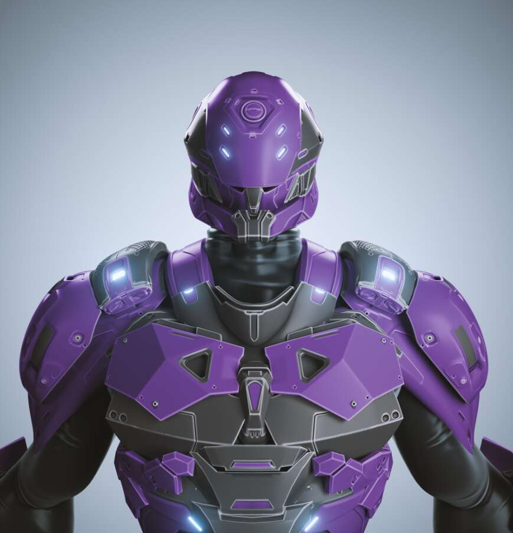

# TheArmors Genesis

3,333 件盔甲

Armors 是 3333 系列，供应量减少，灵感来自 80 年代和 90 年代的动漫系列。

这意味着您将能够自揭幕之日起融合您的盔甲以实现 POWER UPS！。

持有 Armor 可以作为 Armors discord 的 Alpha Pass，持有者将能够访问带有钱包跟踪器、项目分析、alpha 调用和 degen 播放的 Alpha 部分。

其他功能将包括质押、节点访问和合作工具。 该团队将继续开发工具和实用程序，并寻找免费为持有者带来最大收益的方法。 他们的愿景和路线图将与市场趋势保持一致，以确保为其持有者带来最大的盈利能力。

