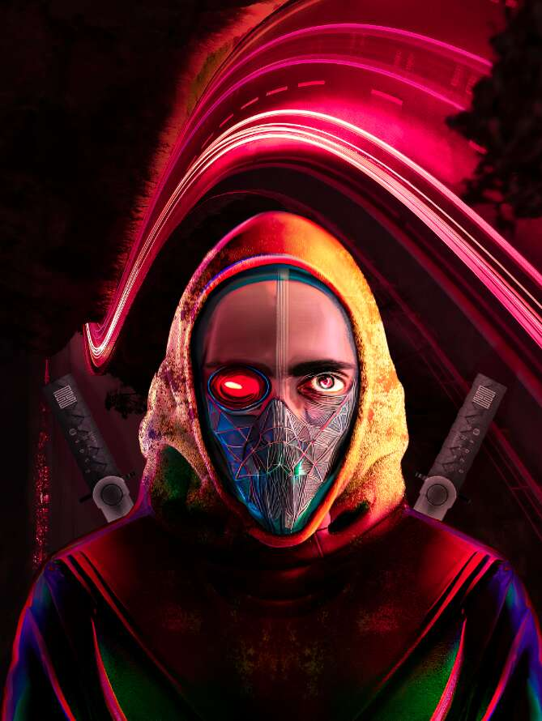

# The Art Memes

Art Memes Collection 专注于大量的乐趣、真正的包容性，并为“为开放的元宇宙（去中心化、社区、自我主权）而战，将这一信息传播给许多人、许多钱包做出贡献。”并向“The 6529 的模因”。 它探索了 OM 的深度和我们的视觉诠释。就像 punk6529 系列一样，“它是一个开放且易于使用的系列。” 版本大小会有所不同，但通常较大且价格实惠，可以广泛传播 可能的。 艺术模因是 CC0。 随着每一次新的 meme 掉落，一些卡片将免费赠送，特定的 ETH 金额将被赠送或用于支持所有类型和级别的艺术家。 模因的总量与元宇宙一样开放，并且很有可能与其他艺术家合作。

