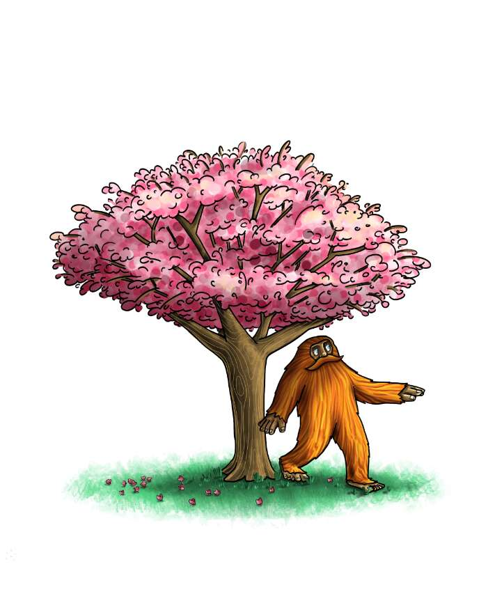

# The Book of Barrels (Volume 1)

The Book of Barrels 是一年一度的 NFT 收藏，其中包含 50 幅独特的 1/1 插图传奇冲浪野人在大自然中被桶装。认识传奇冲浪野人！
参孙是大自然母亲的化身，是一位拥有无限智慧但词汇有限的古老生物（桶桶！）。 Samson 是一个善良的巨人，他的使命是传播欢乐，倡导自然。 他住在一个名为 Naturebarrels 的神奇群岛中，不断地寻找水桶——无论是在水中还是水中。 没有人知道他到底几岁，但他已经足够成为传奇了！

