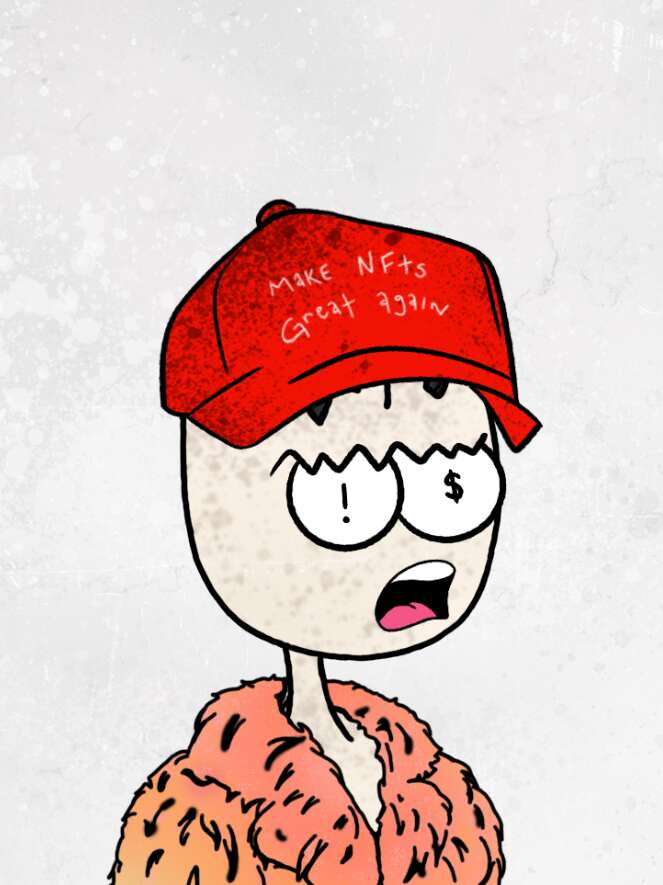

# The Brainiacs

由社区驱动的 1,111 个聪明的头像集合，由一位男性和女性艺术家创作，他们也是该项目的联合创始人。 Brainiacs 的范围包括背景、身体、大脑、帽子、眼睛、嘴巴和他们的衣服等所有层次的柔和感觉。 拥有 Brainiac NFT 允许其所有者为由 Brainiac 社区财政部支付的体验和激活做出贡献。 每个 Brainiac 还可以作为进入“Brainiacland”的通行证，在那里举行高级主题演讲活动，其中包括企业家、web3 爱好者以及 IRL 和 Metaverse 中知名品牌的代表。

