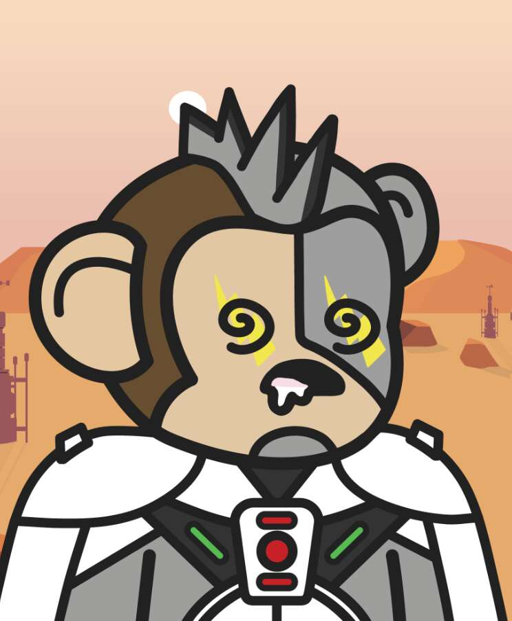

# The Capeverse

随着世界摆脱黑暗，太阳开始升起，神秘的黄色物体开始出现在整个 Capeverse（Cool-Ape Metaverse）的树上。 这些奇怪的物体引起了酷猿的注意，他们的目标是夺取其中的每一个。 在我们穿越 Capeverse 时加入 Cool Apes！ 5.5K NFT，0ETH，12 月 28 日。

酷猿俱乐部
Cool Ape Club 是 5555 只猿的集合，它们分散在元宇宙中寻找神秘的 $BANAZ。 只有您可以将它们聚集在一起并帮助他们获得其中的每一个。

Cool Apes 的持有者也将在 2022 年获得 Jungle Game 的使用权； 一个全功能的游戏赚钱冒险 (P2E) 生态系统，拥有 500 多个独特的场景、交互式迷你游戏以及盗窃和繁殖机制。

